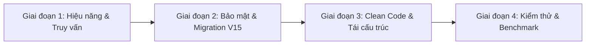

# Kế Hoạch Tối Ưu Hóa Toàn Diện Codebase (Codebase Optimization Plan)

> **Trạng thái**: Hoàn tất 100% (72/72 unit & integration tests PASS, bootJar thành công).  

---

## 🎯 MỤC TIÊU TỐI ƯU HÓA
1. **Hiệu năng (Performance)**:
   - Giảm số lượng truy vấn SQL từ **24 query xuống 1 query** trong API báo cáo dòng tiền năm `getYearlyCashflowSummary`.
   - Giảm thời gian phản hồi API đăng ký từ **~2–3 giây xuống < 100ms** bằng cách chuyển SMTP gửi mail sang bất đồng bộ (`@Async`).
   - Giảm tải DB từ hàng nghìn câu SELECT lặp lại ở mỗi HTTP request bằng cách áp dụng bộ nhớ đệm (Cache) cho thông tin user xác thực JWT.
2. **Bảo mật (Security)**:
   - Triệt tiêu nguy cơ Brute-force OTP bằng cơ chế giới hạn tối đa 5 lần nhập sai và tự động hủy mã.
   - Chuyển CORS từ fix cứng `localhost` sang cấu hình động qua biến môi trường để sẵn sàng cho môi trường Production.
3. **Toàn vẹn dữ liệu (Data Integrity)**:
   - Tạo Flyway migration `V15` tăng độ dài cột `avatar_url` lên `VARCHAR(500)` và chặn trùng lặp kết bạn 2 chiều `(A, B)` và `(B, A)`.
4. **Mã nguồn sạch (Clean Code & Architecture)**:
   - Tách rời xử lý file ra khỏi `UserController`.
   - Xóa bỏ toàn bộ comment rác của AI và các file dead code / DTOs mồ côi.
   - Chuẩn hóa lỗi validation dạng JSON có cấu trúc thay vì chuỗi thô `errors.toString()`.

---

## 🗺️ LỘ TRÌNH 4 GIAI ĐOẠN THỰC THI (PHASE-BY-PHASE)



---

### 🚀 GIAI ĐOẠN 1: TỐI ƯU HIỆU NĂNG & TRUY VẤN DATABASE

#### Task 1.1: Tối ưu query gom nhóm cho `getYearlyCashflowSummary`
- **File cần sửa**:
  - `src/main/java/com/codegym/locketclone/photo/PhotoRepository.java`
  - `src/main/java/com/codegym/locketclone/expense/ExpenseServiceImpl.java`
- **Chi tiết thực hiện**:
  1. Thêm query JPQL gom nhóm trong `PhotoRepository`:
     ```java
     @Query("""
             SELECT 
                 EXTRACT(MONTH FROM COALESCE(p.occurredAt, p.takenAt, p.createdAt)),
                 p.transactionType,
                 COALESCE(SUM(p.amount), 0)
             FROM Photo p
             WHERE p.sender.id = :senderId
               AND p.status <> :deletedStatus
               AND p.amount IS NOT NULL
               AND p.amount > 0
               AND COALESCE(p.occurredAt, p.takenAt, p.createdAt) >= :fromDate
               AND COALESCE(p.occurredAt, p.takenAt, p.createdAt) < :toDate
             GROUP BY EXTRACT(MONTH FROM COALESCE(p.occurredAt, p.takenAt, p.createdAt)), p.transactionType
             """)
     List<Object[]> summarizeMonthlyTransactionsForYear(
             @Param("senderId") UUID senderId,
             @Param("deletedStatus") PhotoStatus deletedStatus,
             @Param("fromDate") LocalDateTime fromDate,
             @Param("toDate") LocalDateTime toDate
     );
     ```
  2. Trong `ExpenseServiceImpl.getYearlyCashflowSummary(UUID userId, Integer year)`:
     - Thay thế vòng lặp 12 tháng (gọi 24 lần query) bằng 1 lệnh gọi duy nhất:
       `fromDate = 01/01/year 00:00:00`, `toDate = 01/01/(year+1) 00:00:00`.
     - Phân bổ kết quả theo từng tháng (từ tháng 1 đến 12) trên RAM Java.
- **Kết quả kỳ vọng**: Tốc độ xử lý API tăng gấp 10-20 lần, giải phóng tài nguyên HikariCP connection pool.

---

#### Task 1.2: Chuyển tiến trình gửi Email OTP sang bất đồng bộ (`@Async`)
- **File cần sửa**:
  - `src/main/java/com/codegym/locketclone/LocketCloneApplication.java`
  - `src/main/java/com/codegym/locketclone/notification/SmtpEmailService.java`
  - `src/main/java/com/codegym/locketclone/notification/LoggingEmailService.java`
- **Chi tiết thực hiện**:
  1. Thêm `@EnableAsync` vào class chính `LocketCloneApplication`.
  2. Gắn annotation `@Async` lên method `sendOtpEmail` trong `SmtpEmailService` và `LoggingEmailService`.
- **Kết quả kỳ vọng**: Khi gọi API `POST /api/v1/auth/register`, client nhận kết quả `201 Created` ngay lập tức mà không phải chờ mạng SMTP Gmail hoàn thành handshake (rút ngắn từ 2-3s xuống < 100ms).

---

#### Task 1.3: Tích hợp Caching tầng xác thực JWT
- **File cần sửa**:
  - `build.gradle` (thêm dependency `com.github.ben-manes.caffeine:caffeine`)
  - `src/main/java/com/codegym/locketclone/security/service/UserDetailsServiceImpl.java`
  - `src/main/java/com/codegym/locketclone/user/UserServiceImpl.java`
- **Chi tiết thực hiện**:
  1. Bật `@EnableCaching` trong ứng dụng.
  2. Cấu hình Caffeine cache cho `loadUserById` với thời hạn sống (TTL) 5 phút.
  3. Thêm `@CacheEvict` khi người dùng cập nhật hồ sơ cá nhân hoặc đổi mật khẩu.
- **Kết quả kỳ vọng**: Loại bỏ 90% các câu `SELECT FROM users WHERE id = ?` sinh ra từ `JwtAuthenticationFilter` trên mỗi request.

---

### 🛡️ GIAI ĐOẠN 2: NÂNG CẤP BẢO MẬT & MIGRATION DATABASE V15

#### Task 2.1: Chống Brute-force mã OTP
- **File cần sửa**:
  - `src/main/java/com/codegym/locketclone/user/User.java`
  - `src/main/java/com/codegym/locketclone/auth/AuthServiceImpl.java`
  - `src/main/java/com/codegym/locketclone/common/exception/ErrorCode.java`
- **Chi tiết thực hiện**:
  1. Thêm thuộc tính `private Integer otpFailedAttempts = 0;` trong `User.java`.
  2. Thêm ErrorCode: `OTP_MAX_ATTEMPTS_EXCEEDED(HttpStatus.BAD_REQUEST, "Mã OTP đã bị khóa do nhập sai quá nhiều lần. Vui lòng đăng ký lại.")`.
  3. Trong `AuthServiceImpl.verify()`:
     - Nếu OTP không khớp: tăng `otpFailedAttempts += 1`.
     - Nếu `otpFailedAttempts >= 5`: xóa mã OTP (`setOtpCode(null)`, `setOtpExpiresAt(null)`), ném lỗi `OTP_MAX_ATTEMPTS_EXCEEDED`.
     - Nếu OTP đúng: reset `otpFailedAttempts = 0`.
     - Khi user đăng ký lại: reset `otpFailedAttempts = 0`.

---

#### Task 2.2: Tạo Migration `V15` hoàn thiện dữ liệu
- **File tạo mới**:
  `src/main/resources/db/migration/V15__harden_schema_and_indexes.sql`
- **Nội dung migration**:
  ```sql
  -- 1. Thêm cột đếm số lần nhập sai OTP
  ALTER TABLE users ADD COLUMN IF NOT EXISTS otp_failed_attempts INTEGER NOT NULL DEFAULT 0;

  -- 2. Nâng độ dài cột avatar_url lên 500 ký tự (tránh DataTruncationException với S3)
  ALTER TABLE users ALTER COLUMN avatar_url TYPE VARCHAR(500);

  -- 3. Đảm bảo chống trùng lặp kết bạn hai chiều (A, B) và (B, A)
  CREATE UNIQUE INDEX IF NOT EXISTS uk_friendships_bidirectional
      ON friendships (LEAST(user_id, friend_id), GREATEST(user_id, friend_id));
  ```

---

#### Task 2.3: Động hóa cấu hình CORS qua biến môi trường
- **File cần sửa**:
  - `src/main/resources/application.yml`
  - `src/main/java/com/codegym/locketclone/common/config/CorsConfig.java`
  - `.env.example`
- **Chi tiết thực hiện**:
  1. Thêm cấu hình trong `application.yml`:
     ```yaml
     app:
       cors:
         allowed-origins: ${CORS_ALLOWED_ORIGINS:http://localhost:5173,http://localhost:3000}
     ```
  2. Cập nhật bean trong `CorsConfig.java`:
     - Tên bean chuẩn hóa thành `corsConfigurationSource()`.
     - Đọc giá trị phân tách dấu phẩy từ biến `allowed-origins`.

---

### 🧹 GIAI ĐOẠN 3: TÁI CẤU TRÚC KIẾN TRÚC & DỌN DẸP CODE RÁC (CLEAN CODE)

#### Task 3.1: Tách rời Controller và Service trong upload Avatar
- **File cần sửa**:
  - `src/main/java/com/codegym/locketclone/user/UserController.java`
  - `src/main/java/com/codegym/locketclone/user/UserService.java`
  - `src/main/java/com/codegym/locketclone/user/UserServiceImpl.java`
- **Chi tiết thực hiện**:
  1. Bổ sung method `UserResponse updateAvatar(UUID userId, MultipartFile file)` vào `UserService`.
  2. Chuyển logic kiểm tra định dạng và gọi upload vào `UserServiceImpl`.
  3. `UserController` chỉ còn nhiệm vụ nhận request và gọi `userService.updateAvatar(...)`.

---

#### Task 3.2: Dọn dẹp Code rác, Comment thừa & Dead Code
- **Hành động**:
  1. **Xóa file dead code**:
     - `src/main/java/com/codegym/locketclone/auth/dto/VerifyFirebaseTokenRequest.java`
     - `src/main/java/com/codegym/locketclone/auth/dto/SetPasswordRequest.java`
     - `src/main/java/com/codegym/locketclone/common/config/FirebaseConfig.java`
     - `src/main/java/com/codegym/locketclone/user/dto/UserRequest.java`
     - `src/main/java/com/codegym/locketclone/user/dto/UpdateFcmTokenRequest.java`
  2. **Dọn rác trong code hiện hữu**:
     - Xóa comment `// ...existing code...` tại dòng 24 trong [`Photo.java`](file:///workspaces/checked-backend/src/main/java/com/codegym/locketclone/photo/Photo.java).
     - Xóa 2 method rỗng `sendFriendRequest` và `acceptFriendRequest` trong `FriendshipService` và `FriendshipServiceImpl` (do luồng kết bạn hiện tại dùng 100% `FriendInviteLinkService`).

---

#### Task 3.3: Chuẩn hóa Response lỗi Validation
- **File cần sửa**:
  - `src/main/java/com/codegym/locketclone/common/exception/ErrorResponse.java`
  - `src/main/java/com/codegym/locketclone/common/exception/GlobalExceptionHandler.java`
- **Chi tiết thực hiện**:
  1. Thêm trường `private Map<String, String> errors;` vào `ErrorResponse`.
  2. Trong `GlobalExceptionHandler.handlingValidation`:
     - Trả về `Map<String, String>` lỗi chuẩn JSON thay vì chuỗi `errors.toString()`. Phía Frontend dễ dàng map lỗi đỏ vào từng field input.

---

### 🧪 GIAI ĐOẠN 4: KIỂM THỬ TOÀN DIỆN & XÁC NHẬN (VERIFICATION)

- [x] Cập nhật unit test hiện hữu để khớp với các thay đổi (`ExpenseServiceImplTest`, `AuthServiceImplTest`, `UserControllerTest`).
- [x] Bổ sung unit test cho:
  - Logic chống brute-force OTP (test nhập sai 5 lần).
  - Logic tính toán yearly cashflow gom nhóm mới.
  - Logic cache xác thực người dùng.
- [x] Chạy kiểm thử:
  ```bash
  ./gradlew test
  ```
- [x] Chạy build đóng gói JAR:
  ```bash
  ./gradlew bootJar
  ```
- [x] Xác nhận toàn bộ 72/72 test case vượt qua và build JAR thành công.

---

## 📋 BẢNG CHECKLIST THỰC HIỆN

| Bước | Nội dung công việc | Người thực hiện | Trạng thái |
| :---: | :--- | :---: | :---: |
| **1.1** | Tối ưu query gom nhóm 1 query cho `getYearlyCashflowSummary` | AI Assistant | ✅ Đã hoàn thành |
| **1.2** | Bật `@Async` cho SMTP gửi email OTP | AI Assistant | ✅ Đã hoàn thành |
| **1.3** | Bổ sung Cache cho `loadUserById` | AI Assistant | ✅ Đã hoàn thành |
| **2.1** | Thêm cơ chế đếm số lần sai và khóa OTP sau 5 lần | AI Assistant | ✅ Đã hoàn thành |
| **2.2** | Viết Flyway migration `V15` (avatar_url 500, unique 2 chiều) | AI Assistant | ✅ Đã hoàn thành |
| **2.3** | Cấu hình động CORS qua biến môi trường | AI Assistant | ✅ Đã hoàn thành |
| **3.1** | Tách rời `CloudinaryService` khỏi `UserController` vào `UserService` | AI Assistant | ✅ Đã hoàn thành |
| **3.2** | Xóa bỏ dead code DTOs, config thừa và comment AI rác | AI Assistant | ✅ Đã hoàn thành |
| **3.3** | Chuẩn hóa cấu trúc JSON cho lỗi validation DTO | AI Assistant | ✅ Đã hoàn thành |
| **4.1** | Chạy `./gradlew test` và `./gradlew bootJar` xác nhận hoàn tất | AI Assistant | ✅ Đã hoàn thành (72/72 tests PASS) |
