# Kế Hoạch & Danh Sách Pull Requests (Pull Requests Roadmap)

> **Tài liệu**: Tổng hợp toàn bộ lộ trình Pull Requests (PR) của dự án `checked-backend` (`locket-clone-api`).  
> **Cập nhật ngày**: 09/10/2026  
> **Trạng thái**:  
> - **Phase 1 (PR #1 – PR #5)**: ✅ **Đã hoàn thành & Đã merge vào `main`**  
> - **Phase 2 (PR #6 – PR #9)**: ✅ **Đã hoàn thành & Đã merge vào `main`**  
> - **Hạ tầng Cơ sở Dữ liệu**: ✅ **Đã kết nối & migrate thành công 16 Flyway scripts trên Neon PostgreSQL Cloud**  
> - **Phase 3 (PR #10 – PR #14)**: 🟡 **Tối ưu hóa Ảnh, SQL Queries, DB Tuning & CI Testcontainers**  
> - **Phase 4 (PR #15 – PR #16)**: ⏳ **ĐÃ DỜI LẠI (Triển khai Heroku Production & CDN khi hoàn tất tối ưu mã nguồn)**

---

## 📊 MA TRẬN TỔNG THỂ DANH SÁCH PULL REQUESTS

```mermaid
flowchart TD
    subgraph PHASE1["✅ Phase 1: Đã hoàn thành (Merged)"]
        PR1["PR #1: fix(security) - CORS & Mask Public User Email"]
        PR2["PR #2: fix(friendship) - Invite Link Concurrency & Quota"]
        PR3["PR #3: fix(db) - Schema V16, Indexes & Income Categories"]
        PR4["PR #4: perf(core) - Decouple S3 IO & Fix CacheEvict"]
        PR5["PR #5: test(quality) - ExpenseController Tests & Cleanup"]
        PR1 --> PR2 --> PR3 --> PR4 --> PR5
    end

    subgraph PHASE2["✅ Phase 2: Đã hoàn thành (Merged)"]
        PR6["PR #6: fix(security)\nJWT Fail-fast, Image Bomb DoS & Friend Privacy\n(Merged: a5455a3)"]
        PR7["PR #7: fix(auth)\nRate Limiting Bucket4j & Fix User Enumeration\n(Merged: cc14d38)"]
        PR8["PR #8: fix(infra)\nSecure Garage Admin Port & Custom Async ThreadPool\n(Merged: 32dd07b)"]
        PR9["PR #9: refactor(core)\nMapStruct PhotoMapper, Storage Parity & Clean Dead Code\n(Merged: 502c5db)"]
        PR6 --> PR7 --> PR8 --> PR9
    end

    subgraph PHASE3["🟡 Phase 3: Tối ưu SQL, DB Tuning & CI Testcontainers"]
        PR10["PR #10: perf(image)\nẢnh vuông 1:1, Zero-copy, Upload song song & S3 Cache-Control\n(Merged: 42d6fca)"]
        PR11["PR #11: perf(db)\nTriệt tiêu N+1 Query Friend List & Rút gọn Token Query\n(Merged: 503e98a)"]
        PR12["PR #12: perf(query)\nBỏ COALESCE dùng B-Tree Index & Gộp Query Cashflow\n(P0 - Khẩn cấp)"]
        PR13["PR #13: perf(db)\nMigration V17 Lower Index, Tắt OSIV & JDBC Batching 25\n(P1 - Cao)"]
        PR14["PR #14: test(ci)\nTestcontainers PostgreSQL kiểm thử Flyway V1-V17 trên CI\n(P1 - Cao)"]
        PR10 --> PR11
        PR11 --> PR12
        PR12 --> PR13
        PR13 --> PR14
    end

    subgraph PHASE4["⏳ Phase 4: Hạ tầng Production & Mở rộng (ĐÃ DỜI LẠI)"]
        PR15["PR #15: deploy(infra)\nTriển khai Heroku Dyno 24/7, Actuator Healthcheck & Neon DB Prod\n(Dời lại đến khi sẵn sàng release)"]
        PR16["PR #16: feat(infra)\nCloudflare CDN Proxy Caching & Presigned URL tải ảnh trực tiếp\n(P2 - Nâng cao)"]
        PR14 -.-> PR15
        PR15 -.-> PR16
    end

    PR5 --> PR6
    PR9 --> PR10
```



### Bảng Ma Trận Chi Tiết

| PR | Nhánh Git | Tiêu đề tóm tắt | Mức độ | Phạm vi ảnh hưởng | Trạng thái |
| :---: | :--- | :--- | :---: | :--- | :---: |
| **#1** | `fix/security-cors-and-idor` | Khắc phục CORS Wildcard, che giấu Email cá nhân & chặn BCrypt DoS | 🔴 P0 | `common/config`, `user`, `auth` | ✅ **Merged** (`838ac3c`) |
| **#2** | `fix/friend-invite-concurrency` | Chống burn quota link mời kết bạn & xử lý race condition | 🔴 P0 | `friendship/invite` | ✅ **Merged** (`18cab7c`) |
| **#3** | `fix/db-schema-and-indexes` | Migration V16 tăng độ dài ảnh, index bạn bè & seed INCOME | 🟡 P1 | `db/migration`, `photo`, `user` | ✅ **Merged** (`4cbfcb5`) |
| **#4** | `perf/upload-tx-and-cache-evict` | Đưa I/O S3 ra ngoài `@Transactional` & sửa lỗi proxy AOP | 🟡 P1 | `photo`, `user`, `security` | ✅ **Merged** (`145c0e5`) |
| **#5** | `test/expense-controller-and-cleanup` | Test `ExpenseController` (12 API), chuẩn hóa lỗi HTTP & dọn dead code | 🟢 P2 | `expense`, `exception`, `test` | ✅ **Merged** (`308c8b3`) |
| **#6** | `fix/security-jwt-image-and-privacy` | **Bắt buộc JWT_SECRET, chặn Image Bomb DoS & ẩn Email bạn bè** | 🔴 **P0 (Critical)** | `security`, `storage/image`, `friendship`, `auth` | ✅ **Merged** (`a5455a3`) |
| **#7** | `fix/auth-rate-limit-and-enumeration` | **Rate Limiting Bucket4j, chặn User Enumeration & bảo vệ đăng ký** | 🔴 **P0 (Critical)** | `auth`, `common/config`, `exception` | ✅ **Merged** (`cc14d38`) |
| **#8** | `fix/infra-garage-security-and-async` | **Đóng port Garage Admin 3903, bảo mật token & tạo Async ThreadPool** | 🟡 **P1 (High)** | `docker`, `compose.yaml`, `config` | ✅ **Merged** (`32dd07b`) |
| **#9** | `refactor/mappers-storage-and-dead-code` | **MapStruct PhotoMapper, đồng bộ Cloudinary & dọn dẹp package `message`** | 🟢 **P2 (Medium)** | `photo`, `storage`, `message`, `common` | ✅ **Merged** (`502c5db`) |
| **#10** | `perf/square-image-and-upload-opt` | **Ảnh vuông 1:1 matching FE, Zero-copy thumbnail, Upload song song & S3 Cache-Control** | 🔴 **P0 (Critical)** | `storage/image`, `storage/s3`, `storage/legacy` | ✅ **Merged** (`42d6fca`) |
| **#11** | `perf/sql-friendship-n-plus-one` | **Triệt tiêu N+1 Query Friend List (`JOIN FETCH`), Read-Only Tx & Tối ưu Invite Token Query** | 🔴 **P0 (Critical)** | `friendship`, `friendship/invite` | ✅ **Merged** (`503e98a`) |
| **#12** | `perf/sql-unwrap-coalesce-indexes` | **Bỏ `COALESCE` kích hoạt B-Tree Index Scan & Gộp Query Cashflow (INCOME/EXPENSE)** | 🔴 **P0 (Critical)** | `photo`, `expense` | ✅ **Merged** (`2ef4d84`) |
| **#13** | `perf/db-tuning-and-lower-indexes` | **Migration V17 Lower Index, Tắt OSIV, Bật JDBC Batching 25 & Khử Login Duplicate Query** | 🟡 **P1 (High)** | `db/migration`, `config`, `auth` | ⏳ **To Do** |
| **#14** | `test/ci-testcontainers-flyway-postgres` | **Kiểm thử Flyway V1-V17 với Testcontainers PostgreSQL trên CI** | 🟡 **P1 (High)** | `src/test`, `.github/workflows/ci.yml` | ⏳ **To Do** |
| **#15** | `deploy/heroku-production-ready` | **Triển khai Heroku Dyno 24/7, Actuator Healthcheck & Cấu hình Neon DB Prod** | ⏳ **P2 (Deferred)** | `config`, `Procfile`, `system.properties`, `security` | ⏸️ **ĐÃ DỜI LẠI** |
| **#16** | `feat/cdn-and-presigned-url` | **Cloudflare CDN Proxy Caching & Presigned URL tải ảnh trực tiếp** | 🟢 **P3 (Low)** | `storage`, `photo` | 📋 **Backlog** |

---

# 🚀 CHI TIẾT CÁC PULL REQUEST PHASE 3 (HIỆN TẠI)

---

### PR #10: `perf(image): square-crop-zero-copy-and-parallel-upload`
- **Mức độ ưu tiên**: 🔴 **P0 - Khẩn cấp (Matching UI Frontend & Tối ưu RAM/Tốc độ)**
- **Nhánh đề xuất**: `perf/square-image-and-upload-opt`
- **Trạng thái**: ✅ **Merged** (`42d6fca`)
- **Mục tiêu**:
  1. **Chuẩn hóa tỷ lệ ảnh 1:1 vuông**: Frontend (ứng dụng Locket Clone) là dạng Widget hình vuông. Hiện tại ảnh chính đang giữ nguyên tỷ lệ chữ nhật gốc (`size(1920, 1920)`), chỉ có thumbnail là hình vuông dẫn đến giao diện bị méo hoặc vỡ layout nếu FE không crop thủ công. Cần center-crop cả ảnh chính và thumbnail về 1:1 ngay từ backend.
  2. **Tự động xoay ảnh theo EXIF (`useExifOrientation(true)`)**: Ngăn chặn tình trạng chụp ảnh dọc/ngang từ điện thoại (iOS/Android) bị xoay 90 độ khi hiển thị.
  3. **Zero-Copy Memory Thumbnail**: Loại bỏ hoàn toàn câu lệnh `ImageIO.read(new ByteArrayInputStream(mainBytes))` gây tốn thêm ~8.3MB RAM Heap và CPU giải mã lặp lại. Tái sử dụng đối tượng `BufferedImage` vuông đã có sẵn trong bộ nhớ để resize trực tiếp xuống thumbnail.
  4. **Upload song song (CompletableFuture)**: Tải lên đồng thời cả ảnh chính và thumbnail lên Garage S3 / Cloudinary thay vì tuần tự, giảm 40–50% thời gian chờ của người dùng.
  5. **Header Cache-Control vĩnh viễn**: Bổ sung `Cache-Control: public, max-age=31536000, immutable` vào metadata S3 Object để trình duyệt và ứng dụng mobile cache vĩnh viễn, triệt tiêu 100% băng thông tải lại ảnh cũ.

#### 1. Các file thay đổi
- `src/main/java/com/codegym/locketclone/common/config/AsyncConfig.java`
- `src/main/java/com/codegym/locketclone/storage/image/ImageProcessingService.java`
- `src/main/java/com/codegym/locketclone/storage/s3/GarageS3StorageService.java`
- `src/main/java/com/codegym/locketclone/storage/legacy/CloudinaryStorageService.java`
- `src/test/java/com/codegym/locketclone/storage/image/ImageProcessingServiceTest.java`
- `src/test/java/com/codegym/locketclone/storage/s3/GarageS3StorageServiceTest.java`
- `src/test/java/com/codegym/locketclone/storage/legacy/CloudinaryStorageServiceTest.java`

#### 2. Chi tiết kỹ thuật
1. **Center Crop Vuông 1:1**:
   - Ảnh chính: Cắt tâm vuông và scale về tối đa $1080 \times 1080\text{px}$, chất lượng JPEG `0.85f`. Chuẩn sắc nét cho màn hình 3x Retina, dung lượng giảm còn ~150–250KB (tiết kiệm 70% băng thông).
   - Thumbnail: Cắt tâm vuông và scale về $320 \times 320\text{px}$, chất lượng JPEG `0.80f` (~20KB).
   - Bật `.useExifOrientation(true)` trong pipeline Thumbnails.
2. **Loại bỏ giải mã thừa trong RAM**:
   ```java
   BufferedImage squareImage = Thumbnails.of(file.getInputStream())
           .useExifOrientation(true)
           .crop(Positions.CENTER)
           .size(PHOTO_SIZE, PHOTO_SIZE)
           .asBufferedImage();
   // Sinh mainBytes từ squareImage
   // Sinh thumbBytes trực tiếp từ squareImage (size 320x320) mà không cần ImageIO.read(mainBytes)
   ```
3. **Upload song song bằng Async**:
   - Sử dụng `CompletableFuture.allOf(...)` kết hợp với `storageTaskExecutor` thực thi song song:
     - `CompletableFuture.runAsync(() -> putObject(mainKey, ...), storageTaskExecutor)`
     - `CompletableFuture.runAsync(() -> putObject(thumbKey, ...), storageTaskExecutor)`
4. **Header Cache-Control trên S3**:
   - Trong `PutObjectRequest.builder()`:
     ```java
     .cacheControl("public, max-age=31536000, immutable")
     ```

#### 3. Tiêu chí nghiệm thu & Test Checklist
- [x] Upload một bức ảnh chữ nhật tỷ lệ 4:3 hoặc 16:9 -> cả `imageUrl` và `thumbnailUrl` đều có kích thước hình vuông 1:1 chính xác ($1080\times 1080$ và $320\times 320$).
- [x] Ảnh chụp có thẻ EXIF Orientation (chụp dọc trên iPhone) hiển thị đúng chiều đứng, không bị xoay ngang.
- [x] Không còn dòng lệnh `ImageIO.read(new ByteArrayInputStream(mainBytes))` trong `ImageProcessingService`.
- [x] S3 Object chứa header `Cache-Control: public, max-age=31536000, immutable`.
- [x] Toàn bộ test suite liên quan đến Image và Storage pass 100% (158/158 tests).

---

### PR #11: `perf(db): fix-n-plus-one-and-friendship-fetch`
- **Mức độ ưu tiên**: 🔴 **P0 - Khẩn cấp (Triệt tiêu 95% latency load danh sách bạn bè)**
- **Nhánh đề xuất**: `perf/sql-friendship-n-plus-one`
- **Trạng thái**: ✅ **Merged** (`503e98a`)
- **Mục tiêu**:
  1. **Triệt tiêu triệt để N+1 Queries**: Bổ sung `JOIN FETCH f.user JOIN FETCH f.friend` vào câu query `findAllAcceptedFriends` trong `FriendshipRepository`. Tải toàn bộ thông tin User của hai đầu mối quan hệ trong 1 câu SQL duy nhất thay vì 51 queries tuần tự.
  2. **Tối ưu Transactional Read-Only**: Chuyển annotation `@Transactional` trong `FriendshipServiceImpl#getAllFriends` sang `@Transactional(readOnly = true)` để Hibernate tắt dirty checking flush, tiết kiệm CPU và bộ nhớ.
  3. **Tối ưu truy vấn Invite Token**: Trong `FriendInviteLinkServiceImpl#acceptByToken`, thay thế logic gọi 2 query tuần tự (`findByTokenAndRevokedAtIsNull` rồi fallback `findByToken`) bằng 1 query duy nhất `findByToken`, kiểm tra trạng thái `revokedAt` trong Java memory.
- **Các file thay đổi**:
  - `src/main/java/com/codegym/locketclone/friendship/FriendshipRepository.java`
  - `src/main/java/com/codegym/locketclone/friendship/FriendshipServiceImpl.java`
  - `src/main/java/com/codegym/locketclone/friendship/invite/FriendInviteLinkServiceImpl.java`
  - `src/test/java/com/codegym/locketclone/friendship/FriendshipServiceImplTest.java`
  - `src/test/java/com/codegym/locketclone/friendship/invite/FriendInviteLinkServiceImplTest.java`
- **Tiêu chí nghiệm thu & Test Checklist**:
  - [x] Gọi API `GET /api/v1/friendships` chỉ phát sinh đúng **1 câu lệnh SQL SELECT** với Hibernate.
  - [x] Logic lấy thông tin bạn bè (username, displayName, avatarUrl) vẫn trả về đầy đủ và chính xác.
  - [x] Toàn bộ unit tests của Friendship và FriendInviteLink pass 100%.

---

### PR #12: `perf(query): unwrap-coalesce-indexes-and-cashflow-aggregation`
- **Mức độ ưu tiên**: 🔴 **P0 - Khẩn cấp (Khôi phục B-Tree Index Scan & Giảm 50% Dashboard Query)**
- **Nhánh đề xuất**: `perf/sql-unwrap-coalesce-indexes`
- **Trạng thái**: ✅ **Merged** (`2ef4d84`)
- **Mục tiêu**:
  1. **Khôi phục B-Tree Index Scan**: Do `occurred_at` đã là `NOT NULL` và có composite index `idx_photos_sender_type_occurred`, việc bọc hàm `COALESCE(p.occurredAt, p.takenAt, p.createdAt)` làm Postgres phải tính toán hàm trên từng dòng và vô hiệu hóa B-Tree index. Cần loại bỏ `COALESCE` khỏi tất cả mệnh đề `WHERE` và `ORDER BY` trong `PhotoRepository`.
  2. **Gộp Query Thống kê Thu / Chi (Cashflow)**: Gộp 2 câu query riêng biệt cho `INCOME` và `EXPENSE` trong `ExpenseServiceImpl#getCashflowSummary` và `#currentSavedForMonth` thành 1 câu truy vấn `GROUP BY p.transactionType`, giảm một nửa số lượng round-trip tới Neon DB khi mở màn hình chính.
- **Các file thay đổi**:
  - `src/main/java/com/codegym/locketclone/photo/PhotoRepository.java`
  - `src/main/java/com/codegym/locketclone/expense/ExpenseServiceImpl.java`
  - `src/test/java/com/codegym/locketclone/expense/ExpenseServiceImplTest.java`
- **Tiêu chí nghiệm thu & Test Checklist**:
  - [x] Không còn hàm `COALESCE(p.occurredAt, ...)` trong các câu query lọc theo khoảng thời gian của `PhotoRepository`.
  - [x] Hàm `getCashflowSummary` chỉ gọi database đúng 1 lần cho việc lấy tổng thu và chi theo tháng.
  - [x] Các bài test tính toán dòng tiền, ngân sách và mục tiêu tiết kiệm pass 100%.

---

### PR #13: `perf(db): lower-user-indexes-and-hibernate-tuning`
- **Mức độ ưu tiên**: 🟡 **P1 - Cao (Index Authentication & Chống Cạn Kiệt Connection Pool)**
- **Nhánh đề xuất**: `perf/db-tuning-and-lower-indexes`
- **Mục tiêu**:
  1. **Migration V17 bổ sung Expression Index**: Tạo unique functional index `LOWER(email)` và `LOWER(username)` để câu query `findByEmailIgnoreCaseOrUsernameIgnoreCase` sử dụng Index Scan thay vì Full Table Scan (Seq Scan).
  2. **Partial Index cho Photo Feed**: Thêm index `idx_photos_feed_status_created ON photos(created_at DESC) WHERE status <> 'DELETED'`.
  3. **Tắt Open-In-View (OSIV)**: Đặt `spring.jpa.open-in-view: false` trong `application.yml` để giải phóng kết nối HikariCP ngay khi Service hoàn tất, loại trừ nguy cơ cạn kiệt connection pool.
  4. **Bật JDBC Batching**: Cấu hình `hibernate.jdbc.batch_size: 25`, `order_inserts: true`, `order_updates: true`, `default_batch_fetch_size: 30` tăng tốc độ lưu danh sách recipient khi upload ảnh lên 3-5 lần.
  5. **Khử Duplicate Query khi Login**: Trong `AuthServiceImpl#login`, tránh gọi trùng lặp `userRepository.findByEmailIgnoreCaseOrUsernameIgnoreCase` trước khi chuyển giao cho `authenticationManager.authenticate`.
- **Các file thay đổi**:
  - `src/main/resources/db/migration/V17__add_lower_user_indexes_and_tuning.sql` *(Tạo mới)*
  - `src/main/resources/application.yml`
  - `src/main/resources/application-prod.yml`
  - `src/main/java/com/codegym/locketclone/auth/AuthServiceImpl.java`
  - `src/test/java/com/codegym/locketclone/auth/AuthServiceImplTest.java`
- **Tiêu chí nghiệm thu & Test Checklist**:
  - [ ] Migration V17 chạy thành công, tạo đầy đủ 3 index trong PostgreSQL.
  - [ ] Đăng nhập gọi đúng 1 lần query tìm kiếm user trong database.
  - [ ] Cấu hình batching và tắt open-in-view không gây lỗi `LazyInitializationException` ở bất kỳ API nào.

---

### PR #14: `test(ci): testcontainers-postgres-for-flyway-validation`
- **Mức độ ưu tiên**: 🟡 **P1 - Cao (Chốt chặn kiểm thử tự động CI)**
- **Nhánh đề xuất**: `test/ci-testcontainers-flyway-postgres`
- **Mục tiêu**:
  1. Kiểm thử toàn bộ chuỗi 17 Flyway scripts (V1 đến V17) và các native query/index trên container PostgreSQL thật bằng Testcontainers.
  2. Đảm bảo mọi commit đẩy lên GitHub Actions đều được xác minh độc lập trên môi trường Postgres chuẩn mà không cần phụ thuộc vào Neon database bên ngoài.
- **Các file thay đổi**:
  - `build.gradle` (thêm dependency `org.testcontainers:postgresql:1.20.4`)
  - `src/test/java/com/codegym/locketclone/config/PostgreSqlTestContainerConfig.java` *(Tạo mới)*
  - `src/test/resources/application.yml`
  - `.github/workflows/ci.yml`
- **Tiêu chí nghiệm thu & Test Checklist**:
  - [ ] Chạy `./gradlew test` tự động kích hoạt container PostgreSQL và kiểm tra 17 script migration thành công.
  - [ ] GitHub Actions CI workflow chạy hoàn tất kiểm thử mà không bị lỗi.

---

# ⏳ CHI TIẾT CÁC PULL REQUEST PHASE 4 (HẠ TẦNG PRODUCTION - ĐÃ DỜI LẠI)

---

### PR #15: `deploy(infra): heroku-dyno-and-neon-production-config` *(ĐÃ DỜI LẠI)*
- **Mức độ ưu tiên**: ⏳ **P2 - Dời lại (Chỉ triển khai khi hoàn tất toàn bộ tối ưu mã nguồn và có lệnh deploy)**
- **Nhánh đề xuất**: `deploy/heroku-production-ready`
- **Mục tiêu**:
  1. Triển khai ứng dụng backend lên Heroku Dyno chạy 24/7 (ứng dụng `heroku-7usd` với gói Dyno Eco/Basic).
  2. Kết nối cơ sở dữ liệu Neon PostgreSQL Cloud qua PgBouncer Pooler (`ep-summer-darkness-b3unuia8-pooler.c-4.ap-southeast-1.aws.neon.tech`).
  3. Cấu hình Spring Boot Actuator `/actuator/health` mở công khai cho Heroku router & UptimeRobot kiểm tra trạng thái sống mà không bị chặn bởi Spring Security.
  4. Tối ưu hóa JVM Memory Options trong Procfile (`-XX:MaxRAMPercentage=75.0 -Xss512k`) phù hợp với giới hạn 512MB RAM của Heroku Dyno.
- **Ghi chú**: Đã dời lại phía sau PR #11 - #14 theo chỉ thị của người dùng để giữ môi trường sạch và tập trung tối ưu code/database trước.

---

### PR #16: `feat(infra): cdn-and-presigned-url` *(Nâng cao)*
- **Mức độ ưu tiên**: 🟢 **P3 - Thấp (Mở rộng quy mô & Giảm tải Heroku)**
- **Nhánh đề xuất**: `feat/cdn-and-presigned-url`
- **Mục tiêu**:
  1. **Cloudflare CDN Proxy**: Thiết lập CDN cache trước S3/R2 giúp giảm latency tải ảnh từ khắp nơi và bảo vệ bucket origin.
  2. **Presigned Upload URL**: Cho phép ứng dụng Frontend tải trực tiếp ảnh lên S3/R2 qua URL cấp tạm thời, bỏ qua dyno Heroku để tiết kiệm băng thông và tránh giới hạn 30s request timeout của Heroku router.

---

# 🚀 CHI TIẾT CÁC PULL REQUEST PHASE 2 (ĐÃ HOÀN THÀNH)

---

### PR #6: `fix(security): jwt-failfast-image-bomb-and-friend-privacy`
- **Trạng thái**: ✅ **Merged** (`a5455a3`)
- **Mục tiêu**:
  1. Loại bỏ hoàn toàn fallback secret key công khai của JWT; ứng dụng crash ngay khi khởi động nếu thiếu `JWT_SECRET`.
  2. Ngăn chặn tấn công cạn kiệt bộ nhớ Heap (Pixel Flood / Decompression Bomb DoS) khi người dùng tải lên hình ảnh có kích thước pixel khổng lồ (> 8192px).
  3. Khắc phục rò rỉ dữ liệu cá nhân (PII): Ẩn địa chỉ email của bạn bè khi lấy danh sách bạn bè và khi chấp nhận link mời kết bạn.
  4. Chuẩn hóa độ dài và độ phức tạp mật khẩu trong `RegisterRequest`.
- **Checklist nghiệm thu**:
  - [x] Khởi động ứng dụng mà không set `JWT_SECRET` -> server dừng ngay với thông báo lỗi rõ ràng.
  - [x] Gửi tệp ảnh có kích thước pixel $10.000 \times 10.000$ -> trả về lỗi HTTP 400 Bad Request mà không làm tăng vọt RAM JVM.
  - [x] Đăng nhập user A, gọi `GET /api/v1/friendships` -> danh sách bạn bè trả về không còn chứa trường `email`.
  - [x] Nhận link mời kết bạn và gọi `POST /api/v1/friend-invite-links/accept` -> response trả về thông tin người mời không có trường `email`.
  - [x] Toàn bộ unit tests chạy pass 100%.

---

### PR #7: `fix(auth): rate-limiting-account-enumeration-and-pending-registration`
- **Trạng thái**: ✅ **Merged** (`cc14d38`)
- **Mục tiêu**:
  1. Bảo vệ endpoint xác thực trước các cuộc tấn công Brute-force và Email Spamming bằng Bucket4j Rate Limiting.
  2. Chống User Enumeration: Chuẩn hóa phản hồi lỗi đăng nhập khi sai tài khoản hoặc sai mật khẩu.
  3. Ngăn chặn việc ghi đè thông tin mật khẩu của tài khoản chưa xác thực (`refreshPendingRegistration`).
- **Checklist nghiệm thu**:
  - [x] Gửi liên tiếp 4 request `POST /api/v1/auth/register` từ cùng 1 IP trong 1 phút -> request thứ 4 nhận mã HTTP 429.
  - [x] Gọi `login` với email không tồn tại -> nhận mã HTTP 401 với thông báo "Thông tin đăng nhập không chính xác".
  - [x] Gọi `login` với email đúng nhưng sai mật khẩu -> nhận mã HTTP 401 cùng nội dung lỗi như trên.
  - [x] Viết test xác minh tính năng Rate Limiting trong test suite.

---

### PR #8: `fix(infra): secure-garage-docker-and-async-threadpool`
- **Trạng thái**: ✅ **Merged** (`32dd07b`)
- **Mục tiêu**:
  1. Đóng port quản trị Garage S3 (3903) ra ngoài môi trường Internet, loại bỏ token hardcode trong git.
  2. Cấu hình `ThreadPoolTaskExecutor` chuyên dụng cho `@Async` để tránh cạn kiệt luồng khi gửi mail số lượng lớn.
- **Checklist nghiệm thu**:
  - [x] Chạy `docker compose config`, xác nhận cổng 3901 (RPC) và 3903 (Admin) không còn bind ra ngoài host.
  - [x] Biến môi trường `GARAGE_RPC_SECRET` và `GARAGE_ADMIN_TOKEN` được cấu hình đầy đủ trong `compose.yaml` và `.env.example`.
  - [x] Ứng dụng gửi email thành công với tên thread log hiển thị tiền tố `mail-exec-*`.
  - [x] Không có lỗi biên dịch hay xung đột executor trong Spring context; 153/153 test suites pass 100%.

---

### PR #9: `refactor(core): sync-mappers-storage-and-clean-deadcode`
- **Trạng thái**: ✅ **Merged** (`502c5db`)
- **Mục tiêu**:
  1. Đồng bộ `PhotoMapper` sang sử dụng thư viện **MapStruct** thay cho việc gán thủ công bằng Builder.
  2. Đồng bộ hóa `CloudinaryStorageService` với `ImageProcessingService` (sinh thumbnail nhất quán với Garage S3).
  3. Xóa bỏ hoàn toàn dead code: package `message/` (`DirectMessage`, `DirectMessageRepository`) và `PhoneNumberUtils`.
- **Checklist nghiệm thu**:
  - [x] Chạy `./gradlew compileJava` sinh code MapStruct cho `PhotoMapperImpl` thành công.
  - [x] Thử nghiệm upload ảnh và xem feed với cả cấu hình `storage.type=garage` và `storage.type=cloudinary`.
  - [x] Codebase biên dịch sạch sẽ, không còn cảnh báo dead code hay file mồ côi (158/158 tests passed 100%).

---

## 📅 LỊCH TRÌNH THỰC HIỆN ĐỀ XUẤT (PHASE 3 & PHASE 4 SCHEDULE)

```
Giai đoạn hiện tại (Phase 3): Tối ưu hóa SQL, DB Index & CI Testcontainers
├── ✅ PR #10: Tối ưu ảnh vuông 1:1, Zero-Copy RAM & Upload song song (Đã merge)
├── ⏳ Bước 1: PR #11 - Triệt tiêu N+1 Query Friend List & Rút gọn Token Query (P0)
├── ⏳ Bước 2: PR #12 - Bỏ COALESCE kích hoạt B-Tree Index & Gộp Query Cashflow (P0)
├── ⏳ Bước 3: PR #13 - Migration V17 Lower Index, Tắt OSIV & Bật JDBC Batching 25 (P1)
└── ⏳ Bước 4: PR #14 - Testcontainers PostgreSQL kiểm thử Flyway V1-V17 trên CI (P1)

Giai đoạn sau (Phase 4): Hạ tầng Production & Mở rộng quy mô (ĐÃ DỜI LẠI)
├── ⏸️ Bước 5: PR #15 - Triển khai Heroku Dyno 24/7, Actuator Healthcheck & Neon DB Prod (Dời lại)
└── 📋 Bước 6: PR #16 - Cloudflare CDN Cache & Presigned Upload URL trực tiếp (Backlog)
```

---

## 📌 HƯỚNG DẪN REVIEW VÀ QUY TẮC MERGE CODE

1. **Nguyên tắc Atomic PR**: Mỗi nhánh chỉ giải quyết đúng phạm vi của PR đó, không gộp lẫn các thay đổi ngoài mục tiêu.
2. **Quy trình tạo nhánh**:
   ```bash
   git checkout main && git pull origin main
   git checkout -b <tên-nhánh-đề-xuất>
   ```
3. **Quy trình kiểm thử trước khi commit**:
   ```bash
   ./gradlew clean test bootJar
   ```
   > Bắt buộc kết quả phải là `BUILD SUCCESSFUL` và 100% test cases đều pass.
4. **Quy tắc Merge**:
   - Merge lần lượt theo thứ tự: `PR #11` ➔ `PR #12` ➔ `PR #13` ➔ `PR #14` ➔ `PR #15 (khi có lệnh deploy)` ➔ `PR #16`.
   - Sử dụng hình thức **Squash and Merge** hoặc **Merge Commit** có message rõ ràng theo quy chuẩn Conventional Commits (`perf:`, `test:`, `deploy:`, `feat:`).
