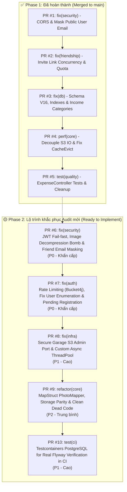

# Kế Hoạch & Danh Sách Pull Requests (Pull Requests Roadmap)

> **Tài liệu**: Tổng hợp toàn bộ lộ trình Pull Requests (PR) của dự án `checked-backend` (`locket-clone-api`).  
> **Cập nhật ngày**: 09/10/2026  
> **Trạng thái**:  
> - **Phase 1 (PR #1 – PR #5)**: ✅ **Đã hoàn thành & Đã merge vào `main`**  
> - **Phase 2 (PR #6 – PR #10)**: 🟡 **Sẵn sàng triển khai sau Audit Bảo mật & Kiến trúc**

---

## 📊 MA TRẬN TỔNG THỂ DANH SÁCH PULL REQUESTS



### Bảng Ma Trận Chi Tiết

| PR | Nhánh Git | Tiêu đề tóm tắt | Mức độ | Phạm vi ảnh hưởng | Trạng thái |
| :---: | :--- | :--- | :---: | :--- | :---: |
| **#1** | `fix/security-cors-and-idor` | Khắc phục CORS Wildcard, che giấu Email cá nhân & chặn BCrypt DoS | 🔴 P0 | `common/config`, `user`, `auth` | ✅ **Merged** (`838ac3c`) |
| **#2** | `fix/friend-invite-concurrency` | Chống burn quota link mời kết bạn & xử lý race condition | 🔴 P0 | `friendship/invite` | ✅ **Merged** (`18cab7c`) |
| **#3** | `fix/db-schema-and-indexes` | Migration V16 tăng độ dài ảnh, index bạn bè & seed INCOME | 🟡 P1 | `db/migration`, `photo`, `user` | ✅ **Merged** (`4cbfcb5`) |
| **#4** | `perf/upload-tx-and-cache-evict` | Đưa I/O S3 ra ngoài `@Transactional` & sửa lỗi proxy AOP | 🟡 P1 | `photo`, `user`, `security` | ✅ **Merged** (`145c0e5`) |
| **#5** | `test/expense-controller-and-cleanup` | Test `ExpenseController` (12 API), chuẩn hóa lỗi HTTP & dọn dead code | 🟢 P2 | `expense`, `exception`, `test` | ✅ **Merged** (`308c8b3`) |
| **#6** | `fix/security-jwt-image-and-privacy` | **Bắt buộc JWT_SECRET, chặn Image Bomb DoS & ẩn Email bạn bè** | 🔴 **P0 (Critical)** | `security`, `storage/image`, `friendship`, `auth` | ✅ **Merged** (`a5455a3`) |
| **#7** | `fix/auth-rate-limit-and-enumeration` | **Rate Limiting Bucket4j, chặn User Enumeration & bảo vệ đăng ký** | 🔴 **P0 (Critical)** | `auth`, `common/config`, `exception` | ✅ **Merged** (`cc14d38`) |
| **#8** | `fix/infra-garage-security-and-async` | **Đóng port Garage Admin 3903, bảo mật token & tạo Async ThreadPool** | 🟡 **P1 (High)** | `docker`, `compose.yaml`, `config` | ✅ **Merged** (`32dd07b`) |
| **#9** | `refactor/mappers-storage-and-dead-code` | **MapStruct PhotoMapper, đồng bộ Cloudinary & dọn dẹp package `message`** | 🟢 **P2 (Medium)** | `photo`, `storage`, `message`, `common` | ⏳ **To Do** |
| **#10** | `test/ci-testcontainers-flyway-postgres` | **Kiểm thử Flyway V1-V16 với Testcontainers PostgreSQL trên CI** | 🟡 **P1 (High)** | `src/test`, `.github/workflows/ci.yml` | ⏳ **To Do** |

---

# 🚀 CHI TIẾT CÁC PULL REQUEST PHASE 2

---

### PR #6: `fix(security): jwt-failfast-image-bomb-and-friend-privacy`
- **Mức độ ưu tiên**: 🔴 **P0 - Khẩn cấp (Critical)**
- **Nhánh đề xuất**: `fix/security-jwt-image-and-privacy`
- **Mục tiêu**:
  1. Loại bỏ hoàn toàn fallback secret key công khai của JWT; ứng dụng crash ngay khi khởi động nếu thiếu `JWT_SECRET`.
  2. Ngăn chặn tấn công cạn kiệt bộ nhớ Heap (Pixel Flood / Decompression Bomb DoS) khi người dùng tải lên hình ảnh có kích thước pixel khổng lồ.
  3. Khắc phục rò rỉ dữ liệu cá nhân (PII): Ẩn địa chỉ email của bạn bè khi lấy danh sách bạn bè và khi chấp nhận link mời kết bạn.
  4. Chuẩn hóa độ dài và độ phức tạp mật khẩu trong `RegisterRequest`.

#### 1. Các file thay đổi
- `src/main/resources/application.yml`
- `src/main/java/com/codegym/locketclone/security/jwt/JwtUtils.java`
- `src/main/java/com/codegym/locketclone/storage/image/ImageProcessingService.java`
- `src/main/java/com/codegym/locketclone/friendship/FriendshipServiceImpl.java`
- `src/main/java/com/codegym/locketclone/friendship/invite/FriendInviteLinkServiceImpl.java`
- `src/main/java/com/codegym/locketclone/friendship/dto/FriendProfileResponse.java` *(Tạo mới)*
- `src/main/java/com/codegym/locketclone/friendship/invite/dto/AcceptFriendInviteLinkResponse.java`
- `src/main/java/com/codegym/locketclone/auth/dto/RegisterRequest.java`
- `src/test/java/com/codegym/locketclone/storage/image/ImageProcessingServiceTest.java`

#### 2. Chi tiết kỹ thuật
1. **JWT Fail-Fast**:
   - Trong `application.yml`, đổi:
     ```yaml
     jwtSecret: ${JWT_SECRET} # Bắt buộc có biến môi trường trên Production
     ```
   - Trong `JwtUtils.java`, kiểm tra trong `@PostConstruct` hoặc hàm get key: nếu `jwtSecret == null || jwtSecret.isBlank()` hoặc giải mã Base64 không đủ 256 bits thì ném `IllegalStateException` chặn khởi động server.
2. **Chống Image Decompression Bomb**:
   - Trong `ImageProcessingService.java`, trước khi gọi `Thumbnails.of(stream)`, sử dụng `ImageReader` chỉ đọc kích thước pixel từ image header:
     ```java
     try (ImageInputStream in = ImageIO.createImageInputStream(file.getInputStream())) {
         Iterator<ImageReader> readers = ImageIO.getImageReaders(in);
         if (readers.hasNext()) {
             ImageReader reader = readers.next();
             reader.setInput(in, true);
             int width = reader.getWidth(0);
             int height = reader.getHeight(0);
             reader.dispose();
             if (width > 8192 || height > 8192) {
                 throw new AppException(ErrorCode.INVALID_PHOTO_FILE);
             }
         }
     }
     ```
3. **Ẩn Email Người Dùng Khỏi API Bạn Bè**:
   - Tạo DTO `FriendProfileResponse(UUID id, String username, String firstName, String lastName, String displayName, String avatarUrl, Boolean isGoldMember)`.
   - Cập nhật `FriendshipServiceImpl#getAllFriends` trả về `List<FriendProfileResponse>`.
   - Cập nhật `AcceptFriendInviteLinkResponse` sử dụng `FriendProfileResponse owner` thay vì `UserResponse`.
4. **Siết chặt Mật Khẩu Đăng Ký**:
   - Thêm quy tắc mật khẩu tối thiểu 8 ký tự, khuyến nghị có ít nhất 1 chữ số trong `RegisterRequest`.

#### 3. Tiêu chí nghiệm thu & Test Checklist
- [ ] Khởi động ứng dụng mà không set `JWT_SECRET` -> server dừng ngay với thông báo lỗi rõ ràng.
- [ ] Gửi tệp ảnh có kích thước pixel $10.000 \times 10.000$ -> trả về lỗi HTTP 400 Bad Request mà không làm tăng vọt RAM JVM.
- [ ] Đăng nhập user A, gọi `GET /api/v1/friendships` -> danh sách bạn bè trả về không còn chứa trường `email`.
- [ ] Nhận link mời kết bạn và gọi `POST /api/v1/friend-invite-links/accept` -> response trả về thông tin người mời không có trường `email`.
- [ ] Toàn bộ unit tests chạy pass 100%.

---

### PR #7: `fix(auth): rate-limiting-account-enumeration-and-pending-registration`
- **Mức độ ưu tiên**: 🔴 **P0 - Khẩn cấp (Critical)**
- **Nhánh đề xuất**: `fix/auth-rate-limit-and-enumeration`
- **Mục tiêu**:
  1. Bảo vệ endpoint xác thực trước các cuộc tấn công Brute-force và Email Spamming bằng Bucket4j Rate Limiting.
  2. Chống User Enumeration: Chuẩn hóa phản hồi lỗi đăng nhập khi sai tài khoản hoặc sai mật khẩu.
  3. Ngăn chặn việc ghi đè thông tin mật khẩu của tài khoản chưa xác thực (`refreshPendingRegistration`).

#### 1. Các file thay đổi
- `build.gradle` (thêm dependency `com.bucket4j:bucket4j-core`)
- `src/main/java/com/codegym/locketclone/common/config/RateLimitConfig.java` *(Tạo mới)*
- `src/main/java/com/codegym/locketclone/security/ratelimit/RateLimitingFilter.java` *(Tạo mới)*
- `src/main/java/com/codegym/locketclone/auth/AuthServiceImpl.java`
- `src/main/java/com/codegym/locketclone/common/exception/ErrorCode.java`
- `src/test/java/com/codegym/locketclone/auth/AuthServiceImplTest.java`
- `src/test/java/com/codegym/locketclone/auth/AuthControllerTest.java`

#### 2. Chi tiết kỹ thuật
1. **Tích hợp Rate Limiting (Bucket4j)**:
   - Cấu hình Filter hoặc Interceptor kiểm tra hạn ngạch dựa trên Client IP:
     - `POST /api/v1/auth/register`: Giới hạn tối đa 3 request / phút / IP.
     - `POST /api/v1/auth/verify`: Giới hạn tối đa 5 request / phút / IP.
     - `POST /api/v1/auth/login`: Giới hạn tối đa 10 request / phút / IP.
   - Khi vượt quá hạn ngạch: Trả về HTTP `429 TOO_MANY_REQUESTS` kèm header `Retry-After`.
2. **Chống User Enumeration Khi Đăng Nhập**:
   - Khi tài khoản không tồn tại trong `login`, thay vì ném `USER_NOT_FOUND` (404), ném `AppException(ErrorCode.UNAUTHORIZED)` hoặc `ErrorCode.INVALID_CREDENTIALS` (401) để thống nhất với lỗi sai mật khẩu.
3. **Bảo Vệ Đăng Ký Trùng Email Chưa Kích Hoạt**:
   - Trong `AuthServiceImpl#register`: Nếu email đã tồn tại và chưa verify, chỉ cho phép gửi lại mã OTP mới sau khi mã cũ hết hạn hoặc sau 60 giây (Resend OTP throttling), không cho phép đổi password và username tùy tiện qua endpoint register.

#### 3. Tiêu chí nghiệm thu & Test Checklist
- [ ] Gửi liên tiếp 4 request `POST /api/v1/auth/register` từ cùng 1 IP trong 1 phút -> request thứ 4 nhận mã HTTP 429.
- [ ] Gọi `login` với email không tồn tại -> nhận mã HTTP 401 với thông báo "Thông tin đăng nhập không chính xác".
- [ ] Gọi `login` với email đúng nhưng sai mật khẩu -> nhận mã HTTP 401 cùng nội dung lỗi như trên.
- [ ] Viết test xác minh tính năng Rate Limiting trong test suite.

---

### PR #8: `fix(infra): secure-garage-docker-and-async-threadpool`
- **Mức độ ưu tiên**: 🟡 **P1 - Cao (High)**
- **Nhánh đề xuất**: `fix/infra-garage-security-and-async`
- **Mục tiêu**:
  1. Đóng port quản trị Garage S3 (3903) ra ngoài môi trường Internet, loại bỏ token hardcode trong git.
  2. Cấu hình `ThreadPoolTaskExecutor` chuyên dụng cho `@Async` để tránh cạn kiệt luồng (Thread Starvation) khi gửi mail số lượng lớn.

#### 1. Các file thay đổi
- `compose.yaml`
- `docker/garage/garage.toml`
- `docker/garage/Dockerfile.init`
- `.env.example`
- `src/main/java/com/codegym/locketclone/common/config/AsyncConfig.java` *(Tạo mới)*

#### 2. Chi tiết kỹ thuật
1. **Bảo Mật Container Garage S3**:
   - Trong `compose.yaml`, xóa dòng `ports: - '3903:3903'`. Cổng quản trị này chỉ được truy cập nội bộ bởi container `garage-init`.
   - Chuyển `admin_token` và `rpc_secret` sang đọc từ biến môi trường `GARAGE_ADMIN_TOKEN` và `GARAGE_RPC_SECRET`.
2. **Khai Báo Thread Pool Cho `@Async`**:
   - Tạo file `AsyncConfig.java`:
     ```java
     @Configuration
     @EnableAsync
     public class AsyncConfig {
         @Bean(name = "mailTaskExecutor")
         public Executor mailTaskExecutor() {
             ThreadPoolTaskExecutor executor = new ThreadPoolTaskExecutor();
             executor.setCorePoolSize(4);
             executor.setMaxPoolSize(16);
             executor.setQueueCapacity(200);
             executor.setThreadNamePrefix("mail-exec-");
             executor.initialize();
             return executor;
         }
     }
     ```
   - Gắn `@Async("mailTaskExecutor")` lên phương thức `sendOtpEmail` trong `SmtpEmailService.java`.

#### 3. Tiêu chí nghiệm thu & Test Checklist
- [x] Chạy `docker compose config`, xác nhận cổng 3901 (RPC) và 3903 (Admin) không còn bind ra ngoài host.
- [x] Biến môi trường `GARAGE_RPC_SECRET` và `GARAGE_ADMIN_TOKEN` được cấu hình đầy đủ trong `compose.yaml` và `.env.example`.
- [x] Ứng dụng gửi email thành công với tên thread log hiển thị tiền tố `mail-exec-*`.
- [x] Không có lỗi biên dịch hay xung đột executor trong Spring context; 153/153 test suites pass 100%.

---

### PR #9: `refactor(core): sync-mappers-storage-and-clean-deadcode`
- **Mức độ ưu tiên**: 🟢 **P2 - Trung bình (Medium)**
- **Nhánh đề xuất**: `refactor/mappers-storage-and-dead-code`
- **Mục tiêu**:
  1. Đồng bộ `PhotoMapper` sang sử dụng thư viện **MapStruct** thay cho việc gán thủ công bằng Builder.
  2. Đồng bộ hóa `CloudinaryStorageService` với `ImageProcessingService` (sinh thumbnail nhất quán với Garage S3).
  3. Xóa bỏ hoàn toàn dead code: package `message/` (`DirectMessage`, `DirectMessageRepository`) và `PhoneNumberUtils`.

#### 1. Các file thay đổi
- `src/main/java/com/codegym/locketclone/common/mapper/PhotoMapper.java`
- `src/main/java/com/codegym/locketclone/storage/legacy/CloudinaryStorageService.java`
- `src/main/java/com/codegym/locketclone/message/DirectMessage.java` *(Xóa bỏ)*
- `src/main/java/com/codegym/locketclone/message/DirectMessageRepository.java` *(Xóa bỏ)*
- `src/main/java/com/codegym/locketclone/common/PhoneNumberUtils.java` *(Xóa bỏ)*
- `src/test/java/com/codegym/locketclone/common/PhoneNumberUtilsTest.java` *(Xóa bỏ)*

#### 2. Chi tiết kỹ thuật
1. **Chuyển `PhotoMapper` Sang MapStruct**:
   - Khai báo interface `@Mapper(componentModel = MappingConstants.ComponentModel.SPRING)`.
   - Định nghĩa các `@Mapping` cho các trường sender (`sender.id` -> `senderId`, `sender.displayName` -> `senderDisplayName`), category (`category.id` -> `categoryId`).
2. **Chuẩn Hóa Cloudinary Thumbnail**:
   - Sử dụng `ImageProcessingService` để xử lý ảnh trước khi gửi lên Cloudinary, đảm bảo cả 2 storage driver đều lưu trữ cả ảnh gốc tối ưu và thumbnail $320\times 320$.
3. **Dọn Rác Dead Code**:
   - Xóa bỏ package `message` để tránh rác database và giảm bớt các bảng không dùng.
   - Xóa `PhoneNumberUtils` do dự án đăng ký bằng email + username, không dùng số điện thoại.

#### 3. Tiêu chí nghiệm thu & Test Checklist
- [ ] Chạy `./gradlew compileJava` sinh code MapStruct cho `PhotoMapperImpl` thành công.
- [ ] Thử nghiệm upload ảnh và xem feed với cả cấu hình `storage.type=garage` và `storage.type=cloudinary`.
- [ ] Codebase biên dịch sạch sẽ, không còn cảnh báo dead code hay file mồ côi.

---

### PR #10: `test(ci): testcontainers-postgres-for-flyway-validation`
- **Mức độ ưu tiên**: 🟡 **P1 - Cao (High)**
- **Nhánh đề xuất**: `test/ci-testcontainers-flyway-postgres`
- **Mục tiêu**:
  1. Loại bỏ điểm mù kiểm thử: Chạy toàn bộ 16 script Flyway migration trên PostgreSQL thật trong test suite.
  2. Bắt sớm các lỗi cú pháp SQL, hàm native (`EXTRACT`, `LEAST`, `GREATEST`), chỉ mục biểu thức và kiểu dữ liệu trước khi đẩy code lên Production.

#### 1. Các file thay đổi
- `build.gradle` (thêm dependency `org.testcontainers:postgresql`)
- `src/test/resources/application.yml`
- `src/test/java/com/codegym/locketclone/config/PostgreSqlTestContainerConfig.java` *(Tạo mới)*
- `.github/workflows/ci.yml`

#### 2. Chi tiết kỹ thuật
1. **Tích hợp Testcontainers PostgreSQL**:
   - Thêm dependency `testImplementation 'org.testcontainers:postgresql:1.20.4'`.
   - Tạo class cấu hình khởi tạo container PostgreSQL động cho Integration Test:
     ```java
     @TestConfiguration(proxyBeanMethods = false)
     public class PostgreSqlTestContainerConfig {
         @Bean
         @ServiceConnection
         public PostgreSQLContainer<?> postgreSqlContainer() {
             return new PostgreSQLContainer<>("postgres:15-alpine");
         }
     }
     ```
2. **Kích hoạt Flyway trong Test**:
   - Cập nhật cấu hình test: `spring.flyway.enabled: true`, `spring.jpa.hibernate.ddl-auto: validate`.
   - Đảm bảo toàn bộ chuỗi migration từ `V1` đến `V16` chạy trơn tru trên PostgreSQL thật.

#### 3. Tiêu chí nghiệm thu & Test Checklist
- [ ] Chạy `./gradlew test` cục bộ tự động kéo image Docker Postgres và áp dụng 16 script migration thành công.
- [ ] GitHub Actions CI pipeline chạy hoàn tất kiểm thử với container Postgres mà không bị timeout.
- [ ] Phát hiện ngay lỗi nếu cố tình sửa sai cú pháp trong một file migration mới.

---

## 📅 LỊCH TRÌNH THỰC HIỆN ĐỀ XUẤT (PHASE 2 EXECUTION SCHEDULE)

```
Tuần 1: Khắc phục Lỗ hổng Bảo mật Cấp thiết (P0)
├── Ngày 1: PR #6 - Sửa JWT Fail-fast, Chặn Image Bomb & Ẩn Email Bạn bè
└── Ngày 2: PR #7 - Tích hợp Rate Limiting Bucket4j & Chặn User Enumeration

Tuần 2: Hạ tầng & Kiểm thử Tích hợp (P1)
├── Ngày 3: PR #8 - Đóng port Garage Admin & Cấu hình Async ThreadPool
└── Ngày 4: PR #10 - Tích hợp Testcontainers PostgreSQL & Bật Flyway trong CI

Tuần 3: Dọn dẹp Kiến trúc & Tối ưu hóa (P2)
└── Ngày 5: PR #9 - Chuyển PhotoMapper sang MapStruct & Dọn sạch Dead Code
```

---

## 📌 HƯỚNG DẪN REVIEW VÀ QUY TẮC MERGE CODE

1. **Nguyên tắc Atomic PR**: Mỗi nhánh chỉ giải quyết đúng phạm vi của PR đó, không gộp lẫn các thay đổi ngoài mục tiêu.
2. **Quy trình tạo nhánh**:
   ```bash
   git checkout main && git pull origin main
   git checkout -b <tên-nhánh-đề-xuất>
   ```
3. **Quy trình kiểm thử trước khi commit**:
   ```bash
   ./gradlew clean test bootJar
   ```
   > Bắt buộc kết quả phải là `BUILD SUCCESSFUL` và 100% test cases đều pass.
4. **Quy tắc Merge**:
   - Merge lần lượt theo thứ tự: `PR #6` ➔ `PR #7` ➔ `PR #8` ➔ `PR #9` ➔ `PR #10`.
   - Sử dụng hình thức **Squash and Merge** hoặc **Merge Commit** có message rõ ràng theo quy chuẩn Conventional Commits (`fix:`, `refactor:`, `test:`).
