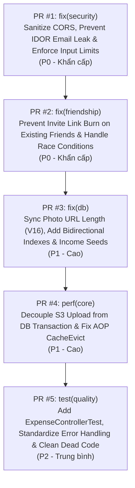

# Kế Hoạch & Danh Sách Pull Requests (Pull Requests Roadmap)

> **Tài liệu**: Phân rã toàn bộ kết quả kiểm toán codebase thành danh sách các Pull Request (PR) độc lập, có thứ tự ưu tiên, phạm vi rõ ràng (atomic), kèm checklist kiểm thử và tiêu chí nghiệm thu.  
> **Dự án**: `checked-backend` (`locket-clone-api`)  
> **Ngày lập kế hoạch**: 09/10/2026  
> **Trạng thái**: 🟡 Đang chờ triển khai (Pending Implementation)

---

## 🗺️ TỔNG QUAN DANH SÁCH PR



---

## 📋 MA TRẬN PHÂN LOẠI PULL REQUESTS

| PR | Nhánh Git | Tiêu đề | Mức độ | Phạm vi ảnh hưởng | Trạng thái |
| :---: | :--- | :--- | :---: | :--- | :---: |
| **#1** | `fix/security-cors-and-idor` | **Bảo mật**: Khắc phục CORS Wildcard, che giấu Email cá nhân & chặn BCrypt DoS | 🔴 **P0 (Critical)** | `common/config`, `user`, `auth` | ✅ Completed |
| **#2** | `fix/friend-invite-concurrency` | **Logic & Chống cạn kiệt**: Sửa lỗi burn link mời và xử lý race condition | 🔴 **P0 (Critical)** | `friendship/invite` | ✅ Completed |
| **#3** | `fix/db-schema-and-indexes` | **Dữ liệu & Truy vấn**: Migration V16 tăng độ dài ảnh, index bạn bè & seed INCOME | 🟡 **P1 (High)** | `db/migration`, `photo`, `user` | ✅ Completed |
| **#4** | `perf/upload-tx-and-cache-evict` | **Hiệu năng & Cache**: Đưa I/O S3 ra ngoài `@Transactional` & sửa lỗi proxy AOP | 🟡 **P1 (High)** | `photo`, `user`, `security` | ⏳ To Do |
| **#5** | `test/expense-controller-and-cleanup` | **Kiểm thử & Clean Code**: Viết test `ExpenseController`, sửa lỗi HTTP 500 & dọn code rác | 🟢 **P2 (Medium)** | `expense`, `exception`, `test`, `build.gradle` | ⏳ To Do |

---

## 🔍 CHI TIẾT TỪNG PULL REQUEST

---

### PR #1: `fix(security): sanitize-cors-and-mask-public-email`
- **Mức độ ưu tiên**: 🔴 **P0 - Khẩn cấp (Critical)**
- **Nhánh**: `fix/security-cors-and-idor`
- **Mục tiêu**: Loại bỏ nguy cơ tấn công Cross-Origin Credentialed attacks và rò rỉ thông tin cá nhân (PII / IDOR) qua endpoint user.

#### 1. Các file thay đổi
- `src/main/resources/application.yml`
- `src/main/java/com/codegym/locketclone/common/config/CorsConfig.java`
- `src/main/java/com/codegym/locketclone/user/UserController.java`
- `src/main/java/com/codegym/locketclone/user/UserService.java`
- `src/main/java/com/codegym/locketclone/user/UserServiceImpl.java`
- `src/main/java/com/codegym/locketclone/user/dto/PublicUserProfileResponse.java` *(Tạo mới)*
- `src/main/java/com/codegym/locketclone/auth/dto/RegisterRequest.java`

#### 2. Chi tiết kỹ thuật
1. **CORS Hardening**:
   - Trong `application.yml`, đổi fallback `app.cors.allowed-origins` từ `*` thành `http://localhost:3000,http://localhost:5173`.
   - Trong `CorsConfig.java`: Nếu cấu hình chứa wildcard `*`, bắt buộc tắt `setAllowCredentials(false)`. Chỉ bật `setAllowCredentials(true)` khi có danh sách domain cụ thể.
2. **Ẩn Email Người Dùng (Fix IDOR / Privacy Leak)**:
   - Tạo DTO `PublicUserProfileResponse` chỉ chứa: `id`, `username`, `firstName`, `lastName`, `displayName`, `avatarUrl`, `isGoldMember`.
   - Cập nhật `GET /api/v1/users/{id}` trả về `PublicUserProfileResponse`. Endpoint `GET /api/v1/users/me` vẫn giữ nguyên `UserResponse` đầy đủ cho chủ tài khoản.
3. **Chống BCrypt DoS**:
   - Thêm `@Size(min = 6, max = 72, message = "Mật khẩu phải từ 6 đến 72 ký tự")` vào `RegisterRequest.java`.

#### 3. Tiêu chí nghiệm thu & Test Checklist
- [x] Gửi request CORS với origin lạ và kiểm tra `Access-Control-Allow-Origin` không trả về `*` kèm `Allow-Credentials: true`.
- [x] Đăng nhập user A, gọi `GET /api/v1/users/{userB_id}`, xác nhận response không còn trường `email`.
- [x] Gọi `GET /api/v1/users/me` xác nhận vẫn nhận đủ `email`.
- [x] Test đăng ký với password dài > 72 ký tự trả về HTTP 400 Validation Error.
- [x] Chạy lại `UserControllerTest` và cập nhật assertions tương ứng.

---

### PR #2: `fix(friendship): prevent-invite-link-burn-and-concurrency`
- **Mức độ ưu tiên**: 🔴 **P0 - Khẩn cấp (Critical)**
- **Nhánh**: `fix/friend-invite-concurrency`
- **Mục tiêu**: Khắc phục lỗi logic cho phép người bạn cũ spam gọi accept link mời làm cạn kiệt 50 lượt sử dụng của link, và xử lý mượt mà xung đột ghi nhận bạn bè đồng thời.

#### 1. Các file thay đổi
- `src/main/java/com/codegym/locketclone/friendship/invite/FriendInviteLinkServiceImpl.java`
- `src/test/java/com/codegym/locketclone/friendship/invite/FriendInviteLinkServiceImplTest.java`

#### 2. Chi tiết kỹ thuật
1. **Kiểm tra trạng thái bạn bè trước khi tăng counter**:
   ```java
   // FriendInviteLinkServiceImpl.java#acceptByToken
   Optional<Friendship> existingFriendship = friendshipRepository.findAcceptedBetweenUsers(ownerUserId, currentUserId);
   if (existingFriendship.isPresent()) {
       // Đã là bạn bè: Trả về thành công ngay lập tức, KHÔNG tăng usedCount!
       return new AcceptFriendInviteLinkResponse(
               existingFriendship.get().getId(),
               existingFriendship.get().getStatus().name(),
               userMapper.toResponse(link.getOwner()),
               LocalDateTime.now()
       );
   }
   ```
2. **Chống Race Condition Khi Accept Đồng Thời**:
   - Đảm bảo khi 2 user cùng bấm link mời của nhau và chạm ràng buộc `uk_friendships_bidirectional`, hệ thống bắt ngoại lệ và trả về quan hệ đã được tạo thành công thay vì văng 500.

#### 3. Tiêu chí nghiệm thu & Test Checklist
- [x] Viết test `acceptByToken_doesNotIncrementUsedCount_whenAlreadyFriends`.
- [x] Xác nhận khi B gọi accept link của A lần thứ 2, `usedCount` của link không thay đổi.
- [x] Tất cả các test trong `FriendInviteLinkServiceImplTest` và `FriendInviteLinkControllerTest` đều PASS.

---

### PR #3: `fix(db): sync-image-url-length-and-add-friendship-index`
- **Mức độ ưu tiên**: 🟡 **P1 - Cao (High)**
- **Nhánh**: `fix/db-schema-and-indexes`
- **Mục tiêu**: Đồng bộ schema DB với JPA Entity, tăng tốc các truy vấn bạn bè 2 chiều và Feed ảnh, đồng thời bổ sung danh mục mẫu cho nguồn tiền vào (INCOME).

#### 1. Các file thay đổi
- `src/main/resources/db/migration/V16__harden_photo_and_friendship_indexes.sql` *(Tạo mới)*
- `src/main/java/com/codegym/locketclone/user/dto/UpdateProfileRequest.java`
- `src/main/java/com/codegym/locketclone/user/dto/UpdatePersonalInfoRequest.java`

#### 2. Chi tiết kỹ thuật
1. **Tạo Migration `V16`**:
   ```sql
   -- 1. Tăng độ dài image_url trong bảng photos khớp với Photo.java (@Column length=500)
   ALTER TABLE photos ALTER COLUMN image_url TYPE VARCHAR(500);

   -- 2. Đảm bảo transaction_type trong categories là NOT NULL
   UPDATE categories SET transaction_type = 'EXPENSE' WHERE transaction_type IS NULL;
   ALTER TABLE categories ALTER COLUMN transaction_type SET NOT NULL;

   -- 3. Tạo index bổ sung cho friend_id và status phục vụ truy vấn feed và bạn bè 2 chiều
   CREATE INDEX IF NOT EXISTS idx_friendships_friend_status ON friendships(friend_id, status);

   -- 4. Tạo index tối ưu hóa thống kê reaction theo thời gian
   CREATE INDEX IF NOT EXISTS idx_photo_reactions_photo_created ON photo_reactions(photo_id, created_at DESC);

   -- 5. Seed danh mục mặc định cho giao dịch INCOME (Thu nhập)
   INSERT INTO categories (id, name, icon, color, user_id, is_default, is_active, transaction_type)
   SELECT uuid_generate_v4(), 'Salary', 'payments', '#66BB6A', NULL, TRUE, TRUE, 'INCOME'
   WHERE NOT EXISTS (SELECT 1 FROM categories WHERE user_id IS NULL AND LOWER(name) = 'salary');

   INSERT INTO categories (id, name, icon, color, user_id, is_default, is_active, transaction_type)
   SELECT uuid_generate_v4(), 'Bonus', 'redeem', '#42A5F5', NULL, TRUE, TRUE, 'INCOME'
   WHERE NOT EXISTS (SELECT 1 FROM categories WHERE user_id IS NULL AND LOWER(name) = 'bonus');

   INSERT INTO categories (id, name, icon, color, user_id, is_default, is_active, transaction_type)
   SELECT uuid_generate_v4(), 'Other Income', 'account_balance_wallet', '#FFA726', NULL, TRUE, TRUE, 'INCOME'
   WHERE NOT EXISTS (SELECT 1 FROM categories WHERE user_id IS NULL AND LOWER(name) = 'other income');
   ```
2. **Đồng bộ DTO Validation**:
   - Trong `UpdateProfileRequest.java` và `UpdatePersonalInfoRequest.java`: Sửa `@Size(max = 255)` của `avatarUrl` thành `@Size(max = 500)`.

#### 3. Tiêu chí nghiệm thu & Test Checklist
- [x] Chạy migration trên PostgreSQL thành công không lỗi cú pháp.
- [x] Khởi động ứng dụng với `spring.jpa.hibernate.ddl-auto: validate` vượt qua thành công.
- [x] Kiểm tra API `GET /api/v1/expense/categories` của user mới có sẵn danh mục `INCOME`.
- [x] Cập nhật avatar với URL dài > 255 ký tự không còn bị chặn ở validation.

---

### PR #4: `perf(core): optimize-photo-upload-tx-and-fix-cache-evict`
- **Mức độ ưu tiên**: 🟡 **P1 - Cao (High)**
- **Nhánh**: `perf/upload-tx-and-cache-evict`
- **Mục tiêu**: Giải phóng kết nối database trong quá trình nén ảnh & upload mạng; sửa lỗi Spring AOP proxy self-invocation làm mất tác dụng xóa cache người dùng; siết chặt xác thực người dùng trong Security Context.

#### 1. Các file thay đổi
- `src/main/java/com/codegym/locketclone/photo/PhotoServiceImpl.java`
- `src/main/java/com/codegym/locketclone/photo/PhotoRepository.java`
- `src/main/java/com/codegym/locketclone/user/UserServiceImpl.java`
- `src/main/java/com/codegym/locketclone/security/service/UserPrincipal.java`
- `src/main/java/com/codegym/locketclone/expense/ExpenseServiceImpl.java`

#### 2. Chi tiết kỹ thuật
1. **Tách I/O Upload S3 Ra Ngoài `@Transactional`**:
   - Trong `PhotoServiceImpl.java`, thực hiện `validateFile`, `storageService.uploadPhoto(file)` **trước** khi mở database transaction.
   - Chỉ bọc `@Transactional` cho phần lưu `photoRepository.save(photo)` và `photoRecipientRepository.saveAll(...)`.
   - Nếu lưu database thất bại, bổ sung khối `catch` gọi `storageService.deleteFile(uploadedImage.key())` để dọn dẹp file mồ côi trên Garage S3.
2. **Sửa Lỗi Proxy Self-Invocation Cache Evict**:
   - Thêm annotation `@CacheEvict(value = "users", key = "#userId")` trực tiếp lên `UserServiceImpl#updatePersonalInfo`.
3. **Gắn Trạng Thái Xác Thực Vào `UserPrincipal`**:
   - Bổ sung trường `boolean isVerified` vào `UserPrincipal`.
   - Cập nhật `UserPrincipal#isEnabled()`:
     ```java
     @Override
     public boolean isEnabled() {
         return isVerified;
     }
     ```
4. **Bổ Sung `@Transactional(readOnly = true)`**:
   - Đánh dấu `readOnly = true` cho các phương thức truy vấn đọc trong `ExpenseServiceImpl` và `PhotoServiceImpl`.

#### 3. Tiêu chí nghiệm thu & Test Checklist
- [ ] Upload ảnh hoạt động bình thường, file lưu lên S3 và metadata lưu vào DB.
- [ ] Giả lập lỗi DB khi lưu photo: Xác nhận file vừa upload lên S3 được xóa dọn dẹp tự động.
- [ ] Gọi `PATCH /api/v1/users/me/settings/personal-info`, kiểm tra Caffeine Cache của user đó bị evict ngay lập tức.
- [ ] User chưa xác thực email khi gửi JWT bị `JwtAuthenticationFilter` chặn với HTTP 403 / 401.

---

### PR #5: `test(quality): add-expense-controller-test-and-clean-dead-code`
- **Mức độ ưu tiên**: 🟢 **P2 - Trung bình (Medium)**
- **Nhánh**: `test/expense-controller-and-cleanup`
- **Mục tiêu**: Bổ sung bộ kiểm thử WebMvc toàn diện cho `ExpenseController` (12 endpoints), chuẩn hóa mã lỗi HTTP khi gọi sai URL/method, và loại bỏ nợ kỹ thuật/dead code.

#### 1. Các file thay đổi
- `src/test/java/com/codegym/locketclone/expense/ExpenseControllerTest.java` *(Tạo mới)*
- `src/main/java/com/codegym/locketclone/common/exception/GlobalExceptionHandler.java`
- `src/main/java/com/codegym/locketclone/notification/SmtpEmailService.java`
- `build.gradle`
- `src/main/java/com/codegym/locketclone/photo/CloudinaryService.java` *(Xóa bỏ)*
- `src/main/java/com/codegym/locketclone/photo/UploadedImage.java` *(Xóa bỏ)*
- `src/main/java/com/codegym/locketclone/common/PhoneNumberUtils.java` *(Xóa bỏ hoặc chuyển vào module hỗ trợ nếu có kế hoạch)*
- `src/test/java/com/codegym/locketclone/common/PhoneNumberUtilsTest.java` *(Dọn dẹp tương ứng)*

#### 2. Chi tiết kỹ thuật
1. **Tạo `ExpenseControllerTest.java`**:
   - Sử dụng `@WebMvcTest(ExpenseController.class)` hoặc mock đầy đủ security context.
   - Kiểm thử tất cả 12 endpoints: `/categories` (GET, POST, PATCH), `/budgets/{monthKey}` (GET, PUT), `/entries`, `/entries/by-period`, `/summary`, `/cashflow`, `/summary/yearly`, `/categories/top`, `/savings-goals/{monthKey}` (GET, PUT).
   - Kiểm thử phân trang, định dạng `monthKey` hợp lệ (`202610`) và không hợp lệ (`invalid`).
2. **Chuẩn Hóa Xử Lý Ngoại Lệ Spring MVC**:
   - Cho `GlobalExceptionHandler` kế thừa `ResponseEntityExceptionHandler` của Spring Boot để giữ nguyên mã lỗi chuẩn:
     - 404 Not Found (thay vì 500 khi gọi sai URL).
     - 405 Method Not Allowed (thay vì 500 khi dùng sai method).
     - 400 Bad Request cho thiếu request parameters.
3. **Dọn Dẹp Dead Code & Dependencies**:
   - Xóa bỏ class `@Deprecated CloudinaryService` và `UploadedImage` không dùng.
   - Xóa dòng trùng lặp `annotationProcessor 'org.projectlombok:lombok'` trong `build.gradle`.
   - Sửa tiêu đề email OTP từ "SnapWidget" thành "Locket Clone" trong `SmtpEmailService`.

#### 3. Tiêu chí nghiệm thu & Test Checklist
- [ ] Test suite mới `ExpenseControllerTest` PASS 100%.
- [ ] Gửi request tới URL không tồn tại `/api/v1/unknown` nhận HTTP 404 (thay vì 500).
- [ ] Gửi request POST tới endpoint chỉ hỗ trợ GET nhận HTTP 405 (thay vì 500).
- [ ] Chạy toàn bộ test `./gradlew clean test` đạt 100% PASS không có lỗi hồi quy.

---

## 📅 LỊCH TRÌNH THỰC HIỆN ĐỀ XUẤT (EXECUTION SCHEDULE)

```
Tuần 1:
├── Ngày 1: Triển khai & Review PR #1 (Bảo mật CORS & IDOR)
├── Ngày 2: Triển khai & Review PR #2 (Logic Friend Invite Link)
└── Ngày 3: Triển khai & Review PR #3 (Flyway Migration V16 & Indexes)

Tuần 2:
├── Ngày 4: Triển khai & Review PR #4 (Tối ưu I/O Upload & Fix Cache AOP)
└── Ngày 5: Triển khai & Review PR #5 (Bổ sung ExpenseControllerTest & Dọn dẹp)
```

---

## 📌 HƯỚNG DẪN REVIEW VÀ MERGE

1. Mỗi PR phải tạo từ nhánh `main` mới nhất:
   ```bash
   git checkout main && git pull origin main
   git checkout -b <branch-name>
   ```
2. Trước khi tạo PR, bắt buộc chạy kiểm thử cục bộ:
   ```bash
   ./gradlew clean test bootJar
   ```
3. Merge theo trình tự: `PR #1` ➔ `PR #2` ➔ `PR #3` ➔ `PR #4` ➔ `PR #5`.  
4. Sau khi merge `PR #3`, xác nhận container DB staging chạy migration `V16` thành công.
