# Kế Hoạch & Danh Sách Pull Requests (Pull Requests Roadmap)

> **Tài liệu**: Tổng hợp toàn bộ lộ trình Pull Requests (PR) của dự án `checked-backend` (`locket-clone-api`).  
> **Cập nhật ngày**: 09/10/2026  
> **Trạng thái**:  
> - **Phase 1 (PR #1 – PR #5)**: ✅ **Đã hoàn thành & Đã merge vào `main`**  
> - **Phase 2 (PR #6 – PR #9)**: ✅ **Đã hoàn thành & Đã merge vào `main`**  
> - **Hạ tầng Cơ sở Dữ liệu**: ✅ **Đã kết nối & migrate thành công 16 Flyway scripts trên Neon PostgreSQL Cloud**  
> - **Phase 3 (PR #10 – PR #13)**: 🟡 **Sẵn sàng triển khai (Tối ưu ảnh vuông 1:1, Production Heroku & CI/CD)**

---

## 📊 MA TRẬN TỔNG THỂ DANH SÁCH PULL REQUESTS

```mermaid
flowchart TD
    subgraph PHASE1["✅ Phase 1: Đã hoàn thành (Merged)"]
        PR1["PR #1: fix(security) - CORS & Mask Public User Email"]
        PR2["PR #2: fix(friendship) - Invite Link Concurrency & Quota"]
        PR3["PR #3: fix(db) - Schema V16, Indexes & Income Categories"]
        PR4["PR #4: perf(core) - Decouple S3 IO & Fix CacheEvict"]
        PR5["PR #5: test(quality) - ExpenseController Tests & Cleanup"]
        PR1 --> PR2 --> PR3 --> PR4 --> PR5
    end

    subgraph PHASE2["✅ Phase 2: Đã hoàn thành (Merged)"]
        PR6["PR #6: fix(security)\nJWT Fail-fast, Image Bomb DoS & Friend Privacy\n(Merged: a5455a3)"]
        PR7["PR #7: fix(auth)\nRate Limiting Bucket4j & Fix User Enumeration\n(Merged: cc14d38)"]
        PR8["PR #8: fix(infra)\nSecure Garage Admin Port & Custom Async ThreadPool\n(Merged: 32dd07b)"]
        PR9["PR #9: refactor(core)\nMapStruct PhotoMapper, Storage Parity & Clean Dead Code\n(Merged: 502c5db)"]
        PR6 --> PR7 --> PR8 --> PR9
    end

    subgraph PHASE3["🟡 Phase 3: Lộ trình hiện tại (Ready to Implement)"]
        PR10["PR #10: perf(image)\nẢnh vuông 1:1 matching FE, Zero-copy thumbnail, Upload song song & S3 Cache-Control\n(P0 - Khẩn cấp)"]
        PR11["PR #11: deploy(infra)\nTriển khai Heroku Dyno 24/7, Actuator Healthcheck & Cấu hình Neon DB Prod\n(P1 - Cao)"]
        PR12["PR #12: test(ci)\nTestcontainers PostgreSQL kiểm thử Flyway V1-V16 trên GitHub Actions\n(P1 - Cao)"]
        PR13["PR #13: feat(infra)\nCloudflare CDN Proxy Caching & Presigned URL tải ảnh trực tiếp\n(P2 - Nâng cao)"]
        PR10 --> PR11
        PR11 --> PR12
        PR12 -.-> PR13
    end

    PR5 --> PR6
    PR9 --> PR10
```



### Bảng Ma Trận Chi Tiết

| PR | Nhánh Git | Tiêu đề tóm tắt | Mức độ | Phạm vi ảnh hưởng | Trạng thái |
| :---: | :--- | :--- | :---: | :--- | :---: |
| **#1** | `fix/security-cors-and-idor` | Khắc phục CORS Wildcard, che giấu Email cá nhân & chặn BCrypt DoS | 🔴 P0 | `common/config`, `user`, `auth` | ✅ **Merged** (`838ac3c`) |
| **#2** | `fix/friend-invite-concurrency` | Chống burn quota link mời kết bạn & xử lý race condition | 🔴 P0 | `friendship/invite` | ✅ **Merged** (`18cab7c`) |
| **#3** | `fix/db-schema-and-indexes` | Migration V16 tăng độ dài ảnh, index bạn bè & seed INCOME | 🟡 P1 | `db/migration`, `photo`, `user` | ✅ **Merged** (`4cbfcb5`) |
| **#4** | `perf/upload-tx-and-cache-evict` | Đưa I/O S3 ra ngoài `@Transactional` & sửa lỗi proxy AOP | 🟡 P1 | `photo`, `user`, `security` | ✅ **Merged** (`145c0e5`) |
| **#5** | `test/expense-controller-and-cleanup` | Test `ExpenseController` (12 API), chuẩn hóa lỗi HTTP & dọn dead code | 🟢 P2 | `expense`, `exception`, `test` | ✅ **Merged** (`308c8b3`) |
| **#6** | `fix/security-jwt-image-and-privacy` | **Bắt buộc JWT_SECRET, chặn Image Bomb DoS & ẩn Email bạn bè** | 🔴 **P0 (Critical)** | `security`, `storage/image`, `friendship`, `auth` | ✅ **Merged** (`a5455a3`) |
| **#7** | `fix/auth-rate-limit-and-enumeration` | **Rate Limiting Bucket4j, chặn User Enumeration & bảo vệ đăng ký** | 🔴 **P0 (Critical)** | `auth`, `common/config`, `exception` | ✅ **Merged** (`cc14d38`) |
| **#8** | `fix/infra-garage-security-and-async` | **Đóng port Garage Admin 3903, bảo mật token & tạo Async ThreadPool** | 🟡 **P1 (High)** | `docker`, `compose.yaml`, `config` | ✅ **Merged** (`32dd07b`) |
| **#9** | `refactor/mappers-storage-and-dead-code` | **MapStruct PhotoMapper, đồng bộ Cloudinary & dọn dẹp package `message`** | 🟢 **P2 (Medium)** | `photo`, `storage`, `message`, `common` | ✅ **Merged** (`502c5db`) |
| **#10** | `perf/square-image-and-upload-opt` | **Ảnh vuông 1:1 matching FE, Zero-copy thumbnail, Upload song song & S3 Cache-Control** | 🔴 **P0 (Critical)** | `storage/image`, `storage/s3`, `storage/legacy` | ⏳ **Sẵn sàng triển khai** |
| **#11** | `deploy/heroku-production-ready` | **Triển khai Heroku Dyno 24/7, Actuator Healthcheck & Cấu hình Neon DB Prod** | 🟡 **P1 (High)** | `config`, `Procfile`, `system.properties`, `security` | ⏳ **Sẵn sàng triển khai** |
| **#12** | `test/ci-testcontainers-flyway-postgres` | **Kiểm thử Flyway V1-V16 với Testcontainers PostgreSQL trên CI** | 🟡 **P1 (High)** | `src/test`, `.github/workflows/ci.yml` | ⏳ **To Do** |
| **#13** | `feat/cdn-and-presigned-url` | **Cloudflare CDN Proxy Caching & Presigned URL tải ảnh trực tiếp** | 🟢 **P2 (Medium)** | `storage`, `photo` | 📋 **Backlog** |

---

# 🚀 CHI TIẾT CÁC PULL REQUEST PHASE 3 (HIỆN TẠI)

---

### PR #10: `perf(image): square-crop-zero-copy-and-parallel-upload`
- **Mức độ ưu tiên**: 🔴 **P0 - Khẩn cấp (Matching UI Frontend & Tối ưu RAM/Tốc độ)**
- **Nhánh đề xuất**: `perf/square-image-and-upload-opt`
- **Mục tiêu**:
  1. **Chuẩn hóa tỷ lệ ảnh 1:1 vuông**: Frontend (ứng dụng Locket Clone) là dạng Widget hình vuông. Hiện tại ảnh chính đang giữ nguyên tỷ lệ chữ nhật gốc (`size(1920, 1920)`), chỉ có thumbnail là hình vuông dẫn đến giao diện bị méo hoặc vỡ layout nếu FE không crop thủ công. Cần center-crop cả ảnh chính và thumbnail về 1:1 ngay từ backend.
  2. **Tự động xoay ảnh theo EXIF (`useExifOrientation(true)`)**: Ngăn chặn tình trạng chụp ảnh dọc/ngang từ điện thoại (iOS/Android) bị xoay 90 độ khi hiển thị.
  3. **Zero-Copy Memory Thumbnail**: Loại bỏ hoàn toàn câu lệnh `ImageIO.read(new ByteArrayInputStream(mainBytes))` gây tốn thêm ~8.3MB RAM Heap và CPU giải mã lặp lại. Tái sử dụng đối tượng `BufferedImage` vuông đã có sẵn trong bộ nhớ để resize trực tiếp xuống thumbnail.
  4. **Upload song song (CompletableFuture)**: Tải lên đồng thời cả ảnh chính và thumbnail lên Garage S3 / Cloudinary thay vì tuần tự, giảm 40–50% thời gian chờ của người dùng.
  5. **Header Cache-Control vĩnh viễn**: Bổ sung `Cache-Control: public, max-age=31536000, immutable` vào metadata S3 Object để trình duyệt và ứng dụng mobile cache vĩnh viễn, triệt tiêu 100% băng thông tải lại ảnh cũ.

#### 1. Các file thay đổi
- `src/main/java/com/codegym/locketclone/storage/image/ImageProcessingService.java`
- `src/main/java/com/codegym/locketclone/storage/s3/GarageS3StorageService.java`
- `src/main/java/com/codegym/locketclone/storage/legacy/CloudinaryStorageService.java`
- `src/test/java/com/codegym/locketclone/storage/image/ImageProcessingServiceTest.java`
- `src/test/java/com/codegym/locketclone/storage/s3/GarageS3StorageServiceTest.java`

#### 2. Chi tiết kỹ thuật
1. **Center Crop Vuông 1:1**:
   - Ảnh chính: Cắt tâm vuông và scale về tối đa $1080 \times 1080\text{px}$, chất lượng JPEG `0.85f`. Chuẩn sắc nét cho màn hình 3x Retina, dung lượng giảm còn ~150–250KB (tiết kiệm 70% băng thông).
   - Thumbnail: Cắt tâm vuông và scale về $320 \times 320\text{px}$, chất lượng JPEG `0.80f` (~20KB).
   - Bật `.useExifOrientation(true)` trong pipeline Thumbnails.
2. **Loại bỏ giải mã thừa trong RAM**:
   ```java
   BufferedImage squareImage = Thumbnails.of(sourceStream)
           .useExifOrientation(true)
           .crop(Positions.CENTER)
           .size(1080, 1080)
           .asBufferedImage();
   // Sinh mainBytes từ squareImage
   // Sinh thumbBytes trực tiếp từ squareImage (size 320x320) mà không cần ImageIO.read(mainBytes)
   ```
3. **Upload song song bằng Async**:
   - Sử dụng `CompletableFuture.allOf(...)` thực thi song song:
     - `CompletableFuture.runAsync(() -> putObject(mainKey, ...))`
     - `CompletableFuture.runAsync(() -> putObject(thumbKey, ...))`
4. **Header Cache-Control trên S3**:
   - Trong `PutObjectRequest.builder()`:
     ```java
     .cacheControl("public, max-age=31536000, immutable")
     ```

#### 3. Tiêu chí nghiệm thu & Test Checklist
- [ ] Upload một bức ảnh chữ nhật tỷ lệ 4:3 hoặc 16:9 -> cả `imageUrl` và `thumbnailUrl` đều có kích thước hình vuông 1:1 chính xác.
- [ ] Ảnh chụp có thẻ EXIF Orientation (chụp dọc trên iPhone) hiển thị đúng chiều đứng, không bị xoay ngang.
- [ ] Không còn dòng lệnh `ImageIO.read(new ByteArrayInputStream(mainBytes))` trong `ImageProcessingService`.
- [ ] S3 Object chứa header `Cache-Control: public, max-age=31536000, immutable`.
- [ ] Toàn bộ test suite liên quan đến Image và Storage pass 100%.

---

### PR #11: `deploy(infra): heroku-dyno-and-neon-production-config`
- **Mức độ ưu tiên**: 🟡 **P1 - Cao (Production Deployment & Connectivity)**
- **Nhánh đề xuất**: `deploy/heroku-production-ready`
- **Mục tiêu**:
  1. Triển khai ứng dụng backend lên Heroku Dyno chạy 24/7 (ứng dụng `heroku-7usd` với gói Dyno Eco/Basic).
  2. Kết nối cơ sở dữ liệu Neon PostgreSQL Cloud qua PgBouncer Pooler (`ep-summer-darkness-b3unuia8-pooler.c-4.ap-southeast-1.aws.neon.tech`).
  3. Cấu hình Spring Boot Actuator `/actuator/health` mở công khai cho Heroku router & UptimeRobot kiểm tra trạng thái sống mà không bị chặn bởi Spring Security.
  4. Tối ưu hóa JVM Memory Options trong Procfile (`-XX:MaxRAMPercentage=75.0 -Xss512k`) phù hợp với giới hạn 512MB RAM của Heroku Dyno.

#### 1. Các file thay đổi
- `Procfile`
- `system.properties`
- `src/main/resources/application.yml`
- `src/main/resources/application-prod.yml`
- `src/main/java/com/codegym/locketclone/security/SecurityConfig.java`
- `build.gradle` (bổ sung `spring-boot-starter-actuator` nếu cần)

#### 2. Chi tiết kỹ thuật
1. **Dynamic Port & Procfile**:
   - `Procfile`: `web: java -Dserver.port=$PORT -XX:MaxRAMPercentage=75.0 -Xss512k -jar build/libs/checked-backend-0.0.1-SNAPSHOT.jar`
   - `system.properties`: `java.runtime.version=21`
2. **Spring Boot Actuator Health Check**:
   - Endpoint: `GET /actuator/health` trả về `{"status":"UP"}`.
   - Thêm `.requestMatchers("/actuator/health").permitAll()` trong `SecurityConfig.java`.
3. **Cấu hình Config Vars trên Heroku**:
   ```bash
   heroku config:set SPRING_PROFILES_ACTIVE=prod -a heroku-7usd
   heroku config:set DB_URL="jdbc:postgresql://ep-summer-darkness-b3unuia8-pooler.c-4.ap-southeast-1.aws.neon.tech:5432/neondb?sslmode=require" -a heroku-7usd
   heroku config:set DB_USERNAME=neondb_owner -a heroku-7usd
   heroku config:set DB_PASSWORD="***" -a heroku-7usd
   heroku config:set JWT_SECRET="***" -a heroku-7usd
   heroku config:set STORAGE_TYPE=cloudinary -a heroku-7usd
   ```

#### 3. Tiêu chí nghiệm thu & Test Checklist
- [ ] Ứng dụng deploy lên Heroku `heroku-7usd` thành công, không gặp lỗi R10 (Boot Timeout) hoặc R14 (Memory Quota Exceeded).
- [ ] Endpoint `GET https://heroku-7usd.herokuapp.com/actuator/health` trả về HTTP 200 OK.
- [ ] Flyway tự động kiểm tra và xác nhận 16 migrations đã áp dụng đầy đủ trên Neon DB.
- [ ] Đăng ký/Đăng nhập và gọi API test từ bên ngoài thành công.

---

### PR #12: `test(ci): testcontainers-postgres-for-flyway-validation`
- **Mức độ ưu tiên**: 🟡 **P1 - Cao (Đảm bảo an toàn CI/CD)**
- **Nhánh đề xuất**: `test/ci-testcontainers-flyway-postgres`
- **Mục tiêu**:
  1. Loại bỏ điểm mù kiểm thử: Chạy toàn bộ 16 script Flyway migration trên PostgreSQL thật trong test suite bằng Testcontainers.
  2. Bắt sớm các lỗi cú pháp SQL native (`EXTRACT`, `LEAST`, `GREATEST`), chỉ mục biểu thức và kiểu dữ liệu trước khi đẩy code lên Production.

#### 1. Các file thay đổi
- `build.gradle` (thêm dependency `org.testcontainers:postgresql`)
- `src/test/resources/application.yml`
- `src/test/java/com/codegym/locketclone/config/PostgreSqlTestContainerConfig.java` *(Tạo mới)*
- `.github/workflows/ci.yml`

#### 2. Chi tiết kỹ thuật
1. **Tích hợp Testcontainers PostgreSQL**:
   - Thêm dependency `testImplementation 'org.testcontainers:postgresql:1.20.4'`.
   - Cấu hình `@ServiceConnection` tự động liên kết với DataSource của Spring Boot Test.
2. **Kích hoạt Flyway trong Test**:
   - Cập nhật cấu hình test: `spring.flyway.enabled: true`, `spring.jpa.hibernate.ddl-auto: validate`.

#### 3. Tiêu chí nghiệm thu & Test Checklist
- [ ] Chạy `./gradlew test` tự động kích hoạt container PostgreSQL và kiểm tra 16 script migration thành công.
- [ ] GitHub Actions CI workflow chạy hoàn tất kiểm thử mà không bị lỗi.

---

### PR #13: `feat(infra): cdn-caching-and-presigned-url` *(Nâng cao)*
- **Mức độ ưu tiên**: 🟢 **P2 - Trung bình (Mở rộng quy mô & Giảm tải Heroku)**
- **Nhánh đề xuất**: `feat/cdn-and-presigned-url`
- **Mục tiêu**:
  1. **Cloudflare CDN Proxy**: Thiết lập CDN cache trước S3/R2 giúp giảm latency tải ảnh từ khắp nơi và bảo vệ bucket origin.
  2. **Presigned Upload URL**: Cho phép ứng dụng Frontend tải trực tiếp ảnh lên S3/R2 qua URL cấp tạm thời, bỏ qua dyno Heroku để tiết kiệm băng thông và tránh giới hạn 30s request timeout của Heroku router.

---

# 🚀 CHI TIẾT CÁC PULL REQUEST PHASE 2 (ĐÃ HOÀN THÀNH)

---

### PR #6: `fix(security): jwt-failfast-image-bomb-and-friend-privacy`
- **Trạng thái**: ✅ **Merged** (`a5455a3`)
- **Mục tiêu**:
  1. Loại bỏ hoàn toàn fallback secret key công khai của JWT; ứng dụng crash ngay khi khởi động nếu thiếu `JWT_SECRET`.
  2. Ngăn chặn tấn công cạn kiệt bộ nhớ Heap (Pixel Flood / Decompression Bomb DoS) khi người dùng tải lên hình ảnh có kích thước pixel khổng lồ (> 8192px).
  3. Khắc phục rò rỉ dữ liệu cá nhân (PII): Ẩn địa chỉ email của bạn bè khi lấy danh sách bạn bè và khi chấp nhận link mời kết bạn.
  4. Chuẩn hóa độ dài và độ phức tạp mật khẩu trong `RegisterRequest`.
- **Checklist nghiệm thu**:
  - [x] Khởi động ứng dụng mà không set `JWT_SECRET` -> server dừng ngay với thông báo lỗi rõ ràng.
  - [x] Gửi tệp ảnh có kích thước pixel $10.000 \times 10.000$ -> trả về lỗi HTTP 400 Bad Request mà không làm tăng vọt RAM JVM.
  - [x] Đăng nhập user A, gọi `GET /api/v1/friendships` -> danh sách bạn bè trả về không còn chứa trường `email`.
  - [x] Nhận link mời kết bạn và gọi `POST /api/v1/friend-invite-links/accept` -> response trả về thông tin người mời không có trường `email`.
  - [x] Toàn bộ unit tests chạy pass 100%.

---

### PR #7: `fix(auth): rate-limiting-account-enumeration-and-pending-registration`
- **Trạng thái**: ✅ **Merged** (`cc14d38`)
- **Mục tiêu**:
  1. Bảo vệ endpoint xác thực trước các cuộc tấn công Brute-force và Email Spamming bằng Bucket4j Rate Limiting.
  2. Chống User Enumeration: Chuẩn hóa phản hồi lỗi đăng nhập khi sai tài khoản hoặc sai mật khẩu.
  3. Ngăn chặn việc ghi đè thông tin mật khẩu của tài khoản chưa xác thực (`refreshPendingRegistration`).
- **Checklist nghiệm thu**:
  - [x] Gửi liên tiếp 4 request `POST /api/v1/auth/register` từ cùng 1 IP trong 1 phút -> request thứ 4 nhận mã HTTP 429.
  - [x] Gọi `login` với email không tồn tại -> nhận mã HTTP 401 với thông báo "Thông tin đăng nhập không chính xác".
  - [x] Gọi `login` với email đúng nhưng sai mật khẩu -> nhận mã HTTP 401 cùng nội dung lỗi như trên.
  - [x] Viết test xác minh tính năng Rate Limiting trong test suite.

---

### PR #8: `fix(infra): secure-garage-docker-and-async-threadpool`
- **Trạng thái**: ✅ **Merged** (`32dd07b`)
- **Mục tiêu**:
  1. Đóng port quản trị Garage S3 (3903) ra ngoài môi trường Internet, loại bỏ token hardcode trong git.
  2. Cấu hình `ThreadPoolTaskExecutor` chuyên dụng cho `@Async` để tránh cạn kiệt luồng khi gửi mail số lượng lớn.
- **Checklist nghiệm thu**:
  - [x] Chạy `docker compose config`, xác nhận cổng 3901 (RPC) và 3903 (Admin) không còn bind ra ngoài host.
  - [x] Biến môi trường `GARAGE_RPC_SECRET` và `GARAGE_ADMIN_TOKEN` được cấu hình đầy đủ trong `compose.yaml` và `.env.example`.
  - [x] Ứng dụng gửi email thành công với tên thread log hiển thị tiền tố `mail-exec-*`.
  - [x] Không có lỗi biên dịch hay xung đột executor trong Spring context; 153/153 test suites pass 100%.

---

### PR #9: `refactor(core): sync-mappers-storage-and-clean-deadcode`
- **Trạng thái**: ✅ **Merged** (`502c5db`)
- **Mục tiêu**:
  1. Đồng bộ `PhotoMapper` sang sử dụng thư viện **MapStruct** thay cho việc gán thủ công bằng Builder.
  2. Đồng bộ hóa `CloudinaryStorageService` với `ImageProcessingService` (sinh thumbnail nhất quán với Garage S3).
  3. Xóa bỏ hoàn toàn dead code: package `message/` (`DirectMessage`, `DirectMessageRepository`) và `PhoneNumberUtils`.
- **Checklist nghiệm thu**:
  - [x] Chạy `./gradlew compileJava` sinh code MapStruct cho `PhotoMapperImpl` thành công.
  - [x] Thử nghiệm upload ảnh và xem feed với cả cấu hình `storage.type=garage` và `storage.type=cloudinary`.
  - [x] Codebase biên dịch sạch sẽ, không còn cảnh báo dead code hay file mồ côi (158/158 tests passed 100%).

---

## 📅 LỊCH TRÌNH THỰC HIỆN ĐỀ XUẤT (PHASE 3 EXECUTION SCHEDULE)

```
Tuần này: Tối ưu UI Frontend & Đưa lên Production
├── Bước 1: PR #10 - Tối ưu ảnh vuông 1:1 matching FE, Zero-Copy RAM & Parallel Upload (P0)
└── Bước 2: PR #11 - Triển khai Heroku Dyno 24/7, Actuator Healthcheck & Cấu hình Neon DB Prod (P1)

Tuần tới: An toàn CI/CD & Mở rộng quy mô
├── Bước 3: PR #12 - Tích hợp Testcontainers PostgreSQL & Bật Flyway trong CI (P1)
└── Bước 4: PR #13 - Cloudflare CDN Cache & Presigned Upload URL trực tiếp (P2)
```

---

## 📌 HƯỚNG DẪN REVIEW VÀ QUY TẮC MERGE CODE

1. **Nguyên tắc Atomic PR**: Mỗi nhánh chỉ giải quyết đúng phạm vi của PR đó, không gộp lẫn các thay đổi ngoài mục tiêu.
2. **Quy trình tạo nhánh**:
   ```bash
   git checkout main && git pull origin main
   git checkout -b <tên-nhánh-đề-xuất>
   ```
3. **Quy trình kiểm thử trước khi commit**:
   ```bash
   ./gradlew clean test bootJar
   ```
   > Bắt buộc kết quả phải là `BUILD SUCCESSFUL` và 100% test cases đều pass.
4. **Quy tắc Merge**:
   - Merge lần lượt theo thứ tự: `PR #10` ➔ `PR #11` ➔ `PR #12` ➔ `PR #13`.
   - Sử dụng hình thức **Squash and Merge** hoặc **Merge Commit** có message rõ ràng theo quy chuẩn Conventional Commits (`perf:`, `deploy:`, `test:`, `feat:`).
