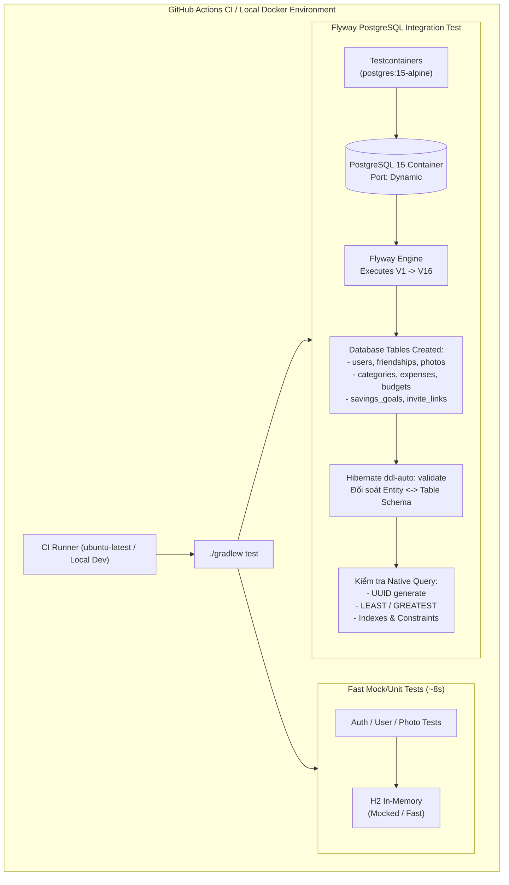

# Plan: PR #10 - Testcontainers PostgreSQL for Real Flyway Verification in CI

## Goal
Loại bỏ hoàn toàn điểm mù kiểm thử cơ sở dữ liệu bằng cách tích hợp Testcontainers PostgreSQL vào hệ thống test; tự động kích hoạt và xác thực chuỗi 16 script Flyway migration (`V1` đến `V16`) trên phiên bản PostgreSQL thực tế (`postgres:15-alpine`), đối soát schema với Hibernate `@Entity` (`ddl-auto: validate`) và cấu hình GitHub Actions CI pipeline để phát hiện sớm mọi lỗi cú pháp SQL trước khi deploy.

---

## Root Cause & Phân Tích Kỹ Thuật

### 1. Điểm Mù Kiểm Thử Khi Dùng H2 In-Memory (Database Dialect Blind Spot)
- **Hiện trạng**:
  - Trong [`src/test/resources/application.yml`](src/test/resources/application.yml#L1-L15):
    ```yaml
    spring:
      datasource:
        url: jdbc:h2:mem:locket-clone-test;MODE=PostgreSQL;...
      jpa:
        hibernate:
          ddl-auto: create-drop
      flyway:
        enabled: false # <-- Bị tắt hoàn toàn trong test suite!
    ```
- **Rủi ro nghiêm trọng**:
  - Toàn bộ 16 script migration của Flyway (`V1__init_database.sql` đến `V16__harden_photo_and_friendship_indexes.sql`) **chưa từng được chạy một lần nào** trong quy trình kiểm thử tự động (`./gradlew test`).
  - Flyway bị tắt trong test vì script `V1` chứa cú pháp đặc thù của PostgreSQL:
    ```sql
    CREATE EXTENSION IF NOT EXISTS "uuid-ossp";
    id UUID DEFAULT uuid_generate_v4() PRIMARY KEY;
    ```
    H2 Database không hỗ trợ lệnh `CREATE EXTENSION`, dẫn đến việc các lập trình viên trước đây buộc phải tắt Flyway trên test để build không bị lỗi.
  - H2 in-memory sử dụng parser riêng, không hỗ trợ đầy đủ các hàm và cú pháp nâng cao của PostgreSQL như:
    - Biểu thức điều kiện trong index (`CREATE INDEX ... WHERE ...`)
    - Hàm xử lý ngày tháng nâng cao (`EXTRACT(EPOCH FROM ...)`)
    - Hàm so sánh giá trị (`LEAST(user_id_1, user_id_2)`, `GREATEST(...)`)
    - Kiểu dữ liệu và ràng buộc JSONB, Partial Unique Index, v.v.
  - Khi một lập trình viên vô tình viết sai cú pháp SQL trong file migration mới, lệnh `./gradlew test` vẫn báo `BUILD SUCCESSFUL 100%`, nhưng ngay khi deploy lên môi trường Production, ứng dụng sẽ crash ngay lập tức khi khởi động (`FlywayException: Migration failed`).

---

### 2. Giải Pháp: Tích Hợp Testcontainers & `@ServiceConnection`
- **Công nghệ**:
  - Thư viện **Testcontainers** (`org.testcontainers:postgresql:1.20.4` và `org.testcontainers:junit-jupiter:1.20.4`).
  - Spring Boot Testcontainers (`org.springframework.boot:spring-boot-testcontainers`) kết hợp annotation `@ServiceConnection`:
    - `@ServiceConnection` tự động trích xuất JDBC URL, username, password từ container đang chạy và cấu hình động vào `DynamicPropertyRegistry` của Spring Boot mà không cần cấu hình thủ công qua `@DynamicPropertySource`.
- **Chiến lược kiểm thử phân tầng (Tiered Testing Strategy)**:
  - **Tầng 1 (Fast Unit/Controller Tests)**: Các test controller (`@WebMvcTest`), test service mock (`@ExtendWith(MockitoExtension.class)`) và context loads cơ bản tiếp tục sử dụng cấu hình H2 nhẹ nhàng, hoàn thành trong vài giây.
  - **Tầng 2 (Database & Flyway Integration Test)**: Tạo test tích hợp chuyên dụng [`FlywayMigrationPostgreSqlIT.java`](src/test/java/com/codegym/locketclone/db/FlywayMigrationPostgreSqlIT.java):
    - Khởi chạy container `postgres:15-alpine`.
    - Kích hoạt `spring.flyway.enabled: true`.
    - Đặt `spring.jpa.hibernate.ddl-auto: validate` để Hibernate đối soát các `@Entity` với bảng do Flyway tạo ra.
    - Hỗ trợ cơ chế `disabledWithoutDocker = true` thông qua `@Testcontainers` hoặc `DockerClientFactory`: nếu máy lập trình viên chưa bật Docker, test sẽ skip một cách an toàn và hiển thị lý do; nhưng khi chạy trên GitHub Actions CI (hoặc máy có Docker), test sẽ **bắt buộc chạy 100%**.

---

### 3. Tự Động Hóa Kiểm Thử Trên GitHub Actions CI
- **Hiện trạng**:
  - File [`.github/workflows/ci.yml`](.github/workflows/ci.yml) chạy trên runner `ubuntu-latest`, vốn đã có sẵn Docker daemon.
  - Lệnh `./gradlew --no-daemon clean test bootJar` sẽ tự động kích hoạt Testcontainers, kéo image `postgres:15-alpine`, chạy migration và kiểm tra tính toàn vẹn.

---

## Kiến Trúc & Thiết Kế Kỹ Thuật



---

## Danh Sách Công Việc (Tasks)

- [ ] **Task 1: Tạo nhánh Git `test/ci-testcontainers-flyway-postgres` từ `main`**
  - Chạy `git checkout -b test/ci-testcontainers-flyway-postgres`.
  - Kiểm tra trạng thái git working tree.

- [ ] **Task 2: Bổ sung Dependencies Testcontainers vào `build.gradle`**
  - Thêm các thư viện vào `build.gradle`:
    ```groovy
    testImplementation 'org.testcontainers:postgresql:1.20.4'
    testImplementation 'org.testcontainers:junit-jupiter:1.20.4'
    testImplementation 'org.springframework.boot:spring-boot-testcontainers'
    ```
  - Chạy `./gradlew dependencies --configuration testRuntimeClasspath` để kiểm tra khả năng resolve thư viện.

- [ ] **Task 3: Xây dựng Cấu hình Testcontainer PostgreSQL & Integration Test**
  - Tạo `src/test/java/com/codegym/locketclone/config/PostgreSqlTestContainerConfig.java`:
    - Định nghĩa bean `@ServiceConnection public PostgreSQLContainer<?> postgreSqlContainer()`.
    - Sử dụng image `postgres:15-alpine`.
  - Tạo `src/test/java/com/codegym/locketclone/db/FlywayMigrationPostgreSqlIT.java`:
    - Đánh dấu `@SpringBootTest`, `@Testcontainers(disabledWithoutDocker = true)`.
    - Import `PostgreSqlTestContainerConfig`.
    - Cấu hình properties: `spring.flyway.enabled=true`, `spring.jpa.hibernate.ddl-auto=validate`.
    - Viết test case 1: Xác nhận toàn bộ migration từ V1 đến V16 hoàn tất và bảng `flyway_schema_history` có 16 bản ghi thành công (`SUCCESS`).
    - Viết test case 2: Thực hiện insert/select thực thể trên PostgreSQL để kiểm tra uuid và quan hệ khóa ngoại.

- [ ] **Task 4: Tinh chỉnh GitHub Actions Workflow `ci.yml`**
  - Trong `.github/workflows/ci.yml`:
    - Xác nhận bước chạy test có quyền truy cập Docker daemon.
    - Đảm bảo thiết lập `timeout-minutes` hợp lý.

- [ ] **Task 5: Kiểm Thử Toàn Diện, Cập Nhật Roadmap, Commit & Merge Vào `main`**
  - Chạy `./gradlew clean test bootJar` đảm bảo toàn bộ unit tests và integration test đều pass hoặc skip an toàn theo điều kiện Docker.
  - Cập nhật tài liệu [`docs/PULL_REQUESTS_ROADMAP.md`](docs/PULL_REQUESTS_ROADMAP.md).
  - Commit với thông điệp: `test(ci): integrate testcontainers postgresql for real flyway schema validation`.
  - Merge nhánh `test/ci-testcontainers-flyway-postgres` vào `main`.

---

## Tiêu Chí Nghiệm Thu (Done When)

- [ ] Dự án có đầy đủ dependencies Testcontainers PostgreSQL tương thích với Spring Boot.
- [ ] Class `FlywayMigrationPostgreSqlIT` khởi tạo container PostgreSQL, chạy trọn vẹn 16 script migration của Flyway và vượt qua `ddl-auto: validate`.
- [ ] Test tự động skip an toàn khi máy cục bộ không mở Docker (`disabledWithoutDocker = true`), không làm sập tiến trình build của các dev không dùng Docker.
- [ ] File `.github/workflows/ci.yml` được cấu hình chuẩn mực để chạy Testcontainers trên CI runner.
- [ ] Lệnh `./gradlew clean test bootJar` hoàn thành thành công (`BUILD SUCCESSFUL`).
- [ ] Nhánh được merge sạch sẽ vào `main`.
