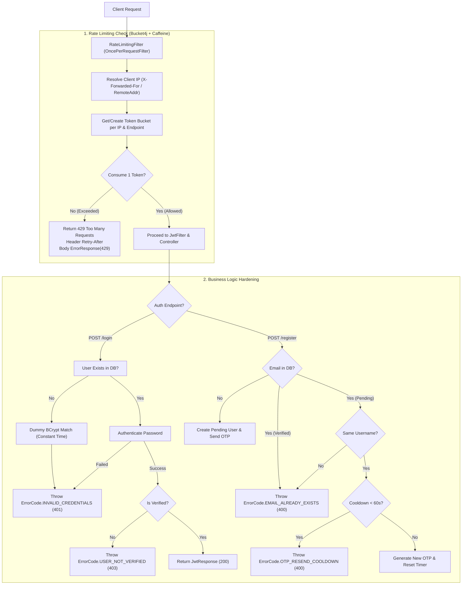

# Plan: PR #7 - Rate Limiting (Bucket4j), Prevent User Enumeration & Secure Pending Registration

## Goal
Bảo vệ hệ thống xác thực người dùng trước các cuộc tấn công Brute-force mật khẩu và OTP spam bằng **Bucket4j Rate Limiting** dựa trên IP, loại bỏ hoàn toàn lỗ hổng **User Enumeration** (dò quét tài khoản) và Timing Attack tại endpoint đăng nhập, đồng thời bảo vệ các tài khoản đang trong trạng thái chờ kích hoạt (`pending registration`) khỏi việc bị ghi đè thông tin hoặc spam OTP email.

---

## Root Cause & Phân Tích Kỹ Thuật

### 1. Thiếu Cơ Chế Giới Hạn Tần Suất Gửi Yêu Cầu (Missing Rate Limiting - CWE-307 / OWASP A07)
- **Hiện trạng**: Các endpoint xác thực public (`/api/v1/auth/register`, `/api/v1/auth/verify`, `/api/v1/auth/login`) không bị giới hạn số lượng request từ một địa chỉ IP.
- **Rủi ro**:
  - Kẻ tấn công có thể spam liên tục endpoint `/register` để làm cạn kiệt tài nguyên gửi email (SMTP rate limits, chi phí mail) và làm rác cơ sở dữ liệu.
  - Endpoint `/verify` xử lý mã OTP 6 chữ số ($10^6$ khả năng). Dù có giới hạn 5 lần sai cho mỗi user, kẻ tấn công có thể tấn công phân tán trên nhiều user hoặc spam làm tê liệt server.
  - Endpoint `/login` có thể bị brute-force hoặc dictionary attack với tốc độ hàng nghìn request/giây.
- **Giải pháp**: Tích hợp thư viện **Bucket4j Core** kết hợp bộ nhớ đệm **Caffeine** để giới hạn Token Bucket cho từng IP:
  - `POST /api/v1/auth/register`: Giới hạn tối đa **3 request / phút / IP**.
  - `POST /api/v1/auth/verify`: Giới hạn tối đa **5 request / phút / IP**.
  - `POST /api/v1/auth/login`: Giới hạn tối đa **10 request / phút / IP**.
  - Trả về HTTP `429 Too Many Requests` kèm header chuẩn `Retry-After: <seconds>` khi vượt ngưỡng.

### 2. Dò Quét Tài Khoản & Tấn Công Thời Gian (User Enumeration & Timing Attack - CWE-204 / OWASP A07)
- **Hiện trạng**: Trong [`AuthServiceImpl.java`](src/main/java/com/codegym/locketclone/auth/AuthServiceImpl.java#L105):
  ```java
  User user = userRepository.findByEmailIgnoreCaseOrUsernameIgnoreCase(identifier, identifier)
          .orElseThrow(() -> new AppException(ErrorCode.USER_NOT_FOUND)); // Trả về HTTP 404
  ```
  Nếu tài khoản không tồn tại, API trả về `404 Not Found`. Nếu tài khoản tồn tại nhưng sai mật khẩu, Spring Security ném `BadCredentialsException` trả về `401 Unauthorized`. Nếu tài khoản chưa verify, trả về `403 Forbidden`.
- **Rủi ro**: Kẻ tấn công có thể kiểm tra danh sách 100.000 email để biết chính xác email nào đã đăng ký tài khoản Locket Clone dựa vào mã lỗi HTTP (404 vs 401/403). Hơn nữa, việc trả về ngay lập tức khi không tìm thấy user (~2ms) so với khi tính toán BCrypt (~70ms) tạo ra độ lệch thời gian (Timing Attack) để đoán tài khoản.
- **Giải pháp**:
  - Khi không tìm thấy tài khoản trong database: Thực hiện một phép kiểm tra mật khẩu giả lập (`passwordEncoder.matches(rawPassword, DUMMY_BCRYPT_HASH)`) để đảm bảo thời gian phản hồi đồng nhất (~70ms), sau đó ném `ErrorCode.INVALID_CREDENTIALS` (HTTP 401).
  - Khi tài khoản tồn tại nhưng sai mật khẩu: Bắt `AuthenticationException` và ném `ErrorCode.INVALID_CREDENTIALS` (HTTP 401) với cùng thông điệp `"Thông tin đăng nhập không chính xác"`.
  - Chỉ khi mật khẩu chính xác nhưng tài khoản chưa kích hoạt mới ném `ErrorCode.USER_NOT_VERIFIED` (HTTP 403).

### 3. Ghi Đè & Spam OTP Tài Khoản Chưa Kích Hoạt (Insecure Pending Registration - CWE-287 / CWE-799)
- **Hiện trạng**: Trong [`AuthServiceImpl.java#refreshPendingRegistration`](src/main/java/com/codegym/locketclone/auth/AuthServiceImpl.java#L120):
  Khi một email đã đăng ký nhưng chưa verify, nếu bất kỳ ai gọi lại `/register` với email đó, hệ thống sẽ:
  - Cho phép đổi username sang username mới.
  - Mã hóa và ghi đè password thành password mới của người gọi sau.
  - Sinh mã OTP mới ngay lập tức mà không có thời gian chờ (cooldown).
- **Rủi ro**:
  - Kẻ xấu biết email của nạn nhân đang chờ verify có thể gửi request ghi đè mật khẩu của nạn nhân bằng mật khẩu của kẻ xấu.
  - Kẻ xấu có thể gọi liên tục để "dội bom" hộp thư email của nạn nhân bằng hàng chục mã OTP mỗi phút.
- **Giải pháp**:
  - Kiểm tra username: Nếu email đã tồn tại trong trạng thái pending, request đăng ký lại phải khớp đúng `username` ban đầu. Nếu khác username, từ chối với `ErrorCode.EMAIL_ALREADY_EXISTS`.
  - Cooldown 60 giây: Nếu mã OTP trước đó được tạo cách đây dưới 60 giây (`otpExpiresAt` còn hơn 4 phút nữa mới hết hạn trong chu kỳ 5 phút), từ chối gửi lại với lỗi `ErrorCode.OTP_RESEND_COOLDOWN` (HTTP 400 - "Vui lòng đợi ít nhất 60 giây trước khi yêu cầu mã OTP mới").

---

## Kiến Trúc & Thiết Kế Kỹ Thuật



---

## Danh Sách Công Việc (Tasks)

- [x] **Task 1: Tạo nhánh Git `fix/auth-rate-limit-and-enumeration` từ `main`**
  - Chạy `git checkout -b fix/auth-rate-limit-and-enumeration` và kiểm tra nhánh.

- [x] **Task 2: Thêm Dependency Bucket4j & Khai Báo Configuration Properties**
  - Thêm `implementation 'com.bucket4j:bucket4j-core:8.10.1'` vào `build.gradle`.
  - Tạo `src/main/java/com/codegym/locketclone/security/ratelimit/RateLimitProperties.java` với các cấu hình:
    - `enabled`: mặc định `true`
    - `registerCapacity`: 3
    - `verifyCapacity`: 5
    - `loginCapacity`: 10
  - Bổ sung cấu hình vào `src/main/resources/application.yml` và `src/test/resources/application.yml`.
  - Thêm các mã lỗi mới vào `ErrorCode.java`:
    - `INVALID_CREDENTIALS(HttpStatus.UNAUTHORIZED, "Thông tin đăng nhập không chính xác")`
    - `TOO_MANY_REQUESTS(HttpStatus.TOO_MANY_REQUESTS, "Bạn đã gửi quá nhiều yêu cầu. Vui lòng thử lại sau.")`
    - `OTP_RESEND_COOLDOWN(HttpStatus.BAD_REQUEST, "Vui lòng đợi ít nhất 60 giây trước khi yêu cầu mã OTP mới")`

- [x] **Task 3: Xây Dựng Service Quản Lý Token Bucket (`RateLimiterService`)**
  - Tạo `src/main/java/com/codegym/locketclone/security/ratelimit/RateLimiterService.java`.
  - Sử dụng Caffeine Cache (`maximumSize = 50_000`, `expireAfterAccess = 10 phút`) lưu trữ Bucket theo `cacheKey = ip + ":" + endpointType`.
  - Xây dựng Bandwidth linh hoạt theo từng endpoint:
    - `REGISTER`: capacity = 3, refill = 3 tokens / 1 minute
    - `VERIFY`: capacity = 5, refill = 5 tokens / 1 minute
    - `LOGIN`: capacity = 10, refill = 10 tokens / 1 minute
  - Trả về kết quả probe (`ConsumptionProbe`) để lấy số giây cần chờ (`getNanosToWaitForRefill`).

- [x] **Task 4: Xây Dựng `RateLimitingFilter` & Tích Hợp Vào Spring Security Chain**
  - Tạo `src/main/java/com/codegym/locketclone/security/ratelimit/RateLimitingFilter.java` kế thừa `OncePerRequestFilter`.
  - Trích xuất Client IP an toàn: ưu tiên đọc IP đầu tiên trong header `X-Forwarded-For`, fallback sang `X-Real-IP` hoặc `request.getRemoteAddr()`. Chuẩn hóa IPv6 localhost (`0:0:0:0:0:0:0:1` -> `127.0.0.1`).
  - Nếu `probe.isConsumed()` thành công: tiếp tục `filterChain.doFilter(request, response)`.
  - Nếu bị chặn: Ghi header `Retry-After: <seconds>`, đặt status `429`, trả về JSON `ErrorResponse(429, message)`.
  - Trong `SecurityConfig.java`: Đăng ký `rateLimitingFilter` trước `LogoutFilter.class` (sớm trong chuỗi filter).

- [x] **Task 5: Khắc Phục User Enumeration & Timing Attack Trong `AuthServiceImpl#login`**
  - Khai báo hằng số `DUMMY_BCRYPT_HASH = "$2a$10$wK1bA3qV7z4p6s9d8f7g5h4j3k2l1m0n9b8v7c6x5z4a3s2d1f0e"`.
  - Nếu `userRepository` không tìm thấy user: Gọi `passwordEncoder.matches(request.password(), DUMMY_BCRYPT_HASH)` để tiêu tốn thời gian tính toán tương đương, sau đó ném `AppException(ErrorCode.INVALID_CREDENTIALS)`.
  - Bắt `AuthenticationException` từ `authenticationManager.authenticate` và ném `AppException(ErrorCode.INVALID_CREDENTIALS)` (HTTP 401).
  - Chỉ kiểm tra `!user.getIsVerified()` sau khi mật khẩu đã được xác thực thành công.

- [x] **Task 6: Bảo Vệ Pending Registration & Cooldown Gửi Lại OTP**
  - Trong `AuthServiceImpl#refreshPendingRegistration`:
    - Kiểm tra `existingUser.getUsername().equalsIgnoreCase(username)`: nếu sai username, ném `AppException(ErrorCode.EMAIL_ALREADY_EXISTS)`.
    - Kiểm tra cooldown: nếu `existingUser.getOtpExpiresAt() != null && existingUser.getOtpExpiresAt().isAfter(LocalDateTime.now().plusMinutes(OTP_EXPIRY_MINUTES - 1))`, ném `AppException(ErrorCode.OTP_RESEND_COOLDOWN)`.
    - Reset `otpFailedAttempts = 0`, sinh mã OTP mới và cập nhật password mới.

- [x] **Task 7: Viết Test Suite Toàn Diện, Chạy Kiểm Thử, Cập Nhật Roadmap, Commit & Merge**
  - Viết `RateLimiterServiceTest.java` và `RateLimitingFilterTest.java` kiểm thử:
    - Quá quota trả về 429 và header `Retry-After`.
    - Phân biệt hạn ngạch giữa các IP và endpoint khác nhau.
    - Xử lý các dạng IP và header `X-Forwarded-For`.
  - Cập nhật và bổ sung test cases trong `AuthServiceImplTest.java` và `AuthControllerTest.java`:
    - Test login sai user trả về 401 `INVALID_CREDENTIALS` (không phải 404).
    - Test login sai password trả về 401 `INVALID_CREDENTIALS`.
    - Test pending register cooldown 60s.
    - Test pending register sai username bị chặn.
  - Chạy `./gradlew clean test bootJar` đảm bảo 100% tests pass.
  - Cập nhật `docs/PULL_REQUESTS_ROADMAP.md` (đánh dấu PR #7 Merged).
  - Git commit: `fix(auth): implement bucket4j rate limiting, fix user enumeration and secure pending registration`.
  - Merge vào `main`.

---

## Tiêu Chí Nghiệm Thu (Done When)

- [x] Gửi request thứ 4 tới `POST /api/v1/auth/register` từ cùng 1 IP trong 1 phút nhận HTTP 429 với header `Retry-After`.
- [x] Gửi request thứ 11 tới `POST /api/v1/auth/login` từ cùng 1 IP trong 1 phút nhận HTTP 429.
- [x] Đăng nhập với email/username không tồn tại trả về HTTP 401 (`ErrorCode.INVALID_CREDENTIALS`), không trả về HTTP 404.
- [x] Đăng nhập với tài khoản tồn tại nhưng sai mật khẩu trả về cùng mã HTTP 401 và cùng message.
- [x] Thời gian xử lý đăng nhập tài khoản không tồn tại và tài khoản sai mật khẩu tương đương nhau (không rò rỉ qua Timing Attack).
- [x] Gọi đăng ký lại với cùng email đang pending trong vòng 60 giây nhận HTTP 400 (`ErrorCode.OTP_RESEND_COOLDOWN`).
- [x] Gọi đăng ký với cùng email đang pending nhưng khác username nhận HTTP 400 (`ErrorCode.EMAIL_ALREADY_EXISTS`).
- [x] Toàn bộ unit tests và integration tests pass 100% với `./gradlew test`.
- [x] Code được merge sạch sẽ vào nhánh `main`.
