# Plan: PR #9 - MapStruct PhotoMapper, Storage Parity & Clean Dead Code

## Goal
Đồng bộ hóa tầng Data Transfer / Mapper sang thư viện MapStruct (`PhotoMapper`), đồng bộ tính năng xử lý ảnh & sinh thumbnail của driver `CloudinaryStorageService` tương thích hoàn toàn với `GarageS3StorageService` (thông qua `ImageProcessingService`), và xóa bỏ triệt để các mã nguồn thừa (dead code) không còn sử dụng (`message/`, `PhoneNumberUtils`).

---

## Root Cause & Phân Tích Kỹ Thuật

### 1. Thủ Công Hóa Mapper & Bất Đồng Bộ Kiến Trúc DTO (Inconsistent Mapping Strategy)
- **Hiện trạng**: 
  - Trong dự án, `UserMapper` đã được chuyển đổi sang **MapStruct 1.6.3** (`@Mapper(componentModel = MappingConstants.ComponentModel.SPRING)`).
  - Tuy nhiên, [`PhotoMapper.java`](src/main/java/com/codegym/locketclone/common/mapper/PhotoMapper.java) vẫn đang được triển khai dưới dạng một `@Component` thông thường với hơn 25 dòng code gán thủ công bằng Builder pattern:
    ```java
    @Component
    public class PhotoMapper {
        public PhotoResponse toResponse(Photo photo) {
            return PhotoResponse.builder()
                .id(photo.getId())
                .senderId(photo.getSender().getId())
                ...
                .categoryId(photo.getCategory() != null ? photo.getCategory().getId() : null)
                .build();
        }
    }
    ```
- **Hệ quả**:
  - Dễ phát sinh lỗi `NullPointerException` nếu có thuộc tính lồng nhau (nested properties) bị thiếu kiểm tra null.
  - Mỗi khi thực thể `Photo` hoặc `PhotoResponse` thêm/bớt trường, lập trình viên phải sửa code thủ công, không tận dụng được cơ chế kiểm tra type-safe tại thời điểm biên dịch (compile-time safety) của MapStruct processor.
- **Giải pháp**:
  - Chuyển `PhotoMapper` thành interface có chú thích `@Mapper(componentModel = MappingConstants.ComponentModel.SPRING)`.
  - Khai báo mapping rõ ràng cho các trường quan hệ:
    - `sender.id -> senderId`
    - `sender.displayName -> senderDisplayName`
    - `sender.avatarUrl -> senderAvatarUrl`
    - `category.id -> categoryId`
    - `category.name -> categoryName`
  - MapStruct 1.6.3 tự động tạo code kiểm tra null an toàn và hỗ trợ trực tiếp Java record `PhotoResponse`.

---

### 2. Bất Đồng Bộ Giữa Các Driver Lưu Trữ Hình Ảnh (Storage Driver Feature Parity)
- **Hiện trạng**:
  - `GarageS3StorageService` sử dụng `ImageProcessingService` để:
    1. Kiểm tra kích thước pixel chống Decompression Bomb DoS.
    2. Resize ảnh gốc về độ phân giải tối ưu ($1920\times 1920$ max, JPEG quality 85%).
    3. Tự động crop và nén ảnh thu nhỏ thumbnail ($320\times 320$ cho feed photo, $150\times 150$ cho avatar).
    4. Trả về đối tượng `UploadedFile` với `thumbnailUrl` riêng biệt.
  - Trong khi đó, [`CloudinaryStorageService.java`](src/main/java/com/codegym/locketclone/storage/legacy/CloudinaryStorageService.java) lại gửi trực tiếp `file.getBytes()` nguyên bản lên Cloudinary mà không qua `ImageProcessingService`:
    ```java
    // Dòng 61-62 trong CloudinaryStorageService:
    return new UploadedFile(
        secureUrl,
        secureUrl, // <-- thumbnailUrl bị gán trùng bằng chính ảnh gốc!
        publicId,
        ...
    );
    ```
- **Hệ quả**:
  - Khi cấu hình `storage.type=cloudinary`, ảnh không được kiểm tra chiều dài/rộng pixel (nguy cơ vượt ngưỡng tải), không được tối ưu dung lượng trước khi truyền qua mạng, và trường `thumbnailUrl` trỏ thẳng vào ảnh gốc nặng nề, gây tốn băng thông client mobile khi tải feed.
- **Giải pháp**:
  - Tiêm `ImageProcessingService` vào `CloudinaryStorageService`.
  - Xử lý ảnh đầu vào (`processPhoto`, `processAvatar`) để thu được `ProcessedImage` với `originalBytes` và `thumbnailBytes`.
  - Tải lên cả ảnh gốc tối ưu (thư mục `locket/photos` hoặc `locket/avatars`) và thumbnail (thư mục `locket/photos/thumbs` hoặc `locket/avatars/thumbs`).
  - Gán đúng `thumbnailUrl` từ kết quả upload của thumbnail.
  - Cập nhật hàm `deleteFile` để dọn sạch cả ảnh chính và thumbnail trên Cloudinary.

---

### 3. Tồn Tại Dead Code Trong Dự Án (Technical Debt & Code Hygiene)
- **Hiện trạng**:
  - Package [`com.codegym.locketclone.message`](src/main/java/com/codegym/locketclone/message) chứa 2 file `DirectMessage.java` và `DirectMessageRepository.java`. Toàn bộ codebase không có bất kỳ Controller, Service hay DTO nào sử dụng hay gọi tới các class này.
  - Class [`PhoneNumberUtils.java`](src/main/java/com/codegym/locketclone/common/PhoneNumberUtils.java) (cùng test [`PhoneNumberUtilsTest.java`](src/test/java/com/codegym/locketclone/common/PhoneNumberUtilsTest.java)): Dự án Checked đã chuyển đổi hoàn toàn cơ chế định danh sang email và username, không còn quy trình đăng ký/đăng nhập bằng số điện thoại.
- **Hệ quả**:
  - `DirectMessage` là một JPA `@Entity`, khiến Hibernate phải quét qua, ánh xạ metadata và duy trì quản lý entity context một cách vô ích.
  - Gây hiểu nhầm về phạm vi tính năng (feature confusion) cho các lập trình viên khác khi maintain hoặc mở rộng hệ thống.
- **Giải pháp**:
  - Xóa bỏ package `message/` (`DirectMessage.java`, `DirectMessageRepository.java`).
  - Xóa bỏ `PhoneNumberUtils.java` và `PhoneNumberUtilsTest.java`.

---

## Kiến Trúc & Thiết Kế Kỹ Thuật

```mermaid
flowchart TD
    subgraph MappingLayer["Tầng Chuyển Đổi DTO (MapStruct 1.6.3)"]
        PhotoEntity["Photo Entity\n(sender, category, caption,...)"] --> PhotoMapperIface["PhotoMapper (Interface)\n@Mapper(componentModel = SPRING)"]
        PhotoMapperIface --> PhotoMapperGenerated["PhotoMapperImpl (Generated)\nCompile-time Safe / Null-safe"]
        PhotoMapperGenerated --> PhotoResponseRecord["PhotoResponse (Java Record)\nsenderId, categoryId, thumbnailUrl,..."]
    end

    subgraph StorageLayer["Tầng Lưu Trữ Thống Nhất (Storage Parity)"]
        MultipartUpload["MultipartFile Upload"] --> ImageProc["ImageProcessingService\n- Pixel limit check (<=8192px)\n- Main optimize (<=1920px)\n- Thumbnail crop (320x320)"]
        ImageProc --> Processed["ProcessedImage\n(originalBytes, thumbBytes)"]
        
        Processed --> GarageS3["GarageS3StorageService\n- S3 Main Key\n- S3 Thumb Key"]
        Processed --> Cloudinary["CloudinaryStorageService\n- Folder: locket/photos\n- Folder: locket/photos/thumbs"]
        
        GarageS3 --> ReturnDTO["UploadedFile (secureUrl, thumbnailUrl, key,...)"]
        Cloudinary --> ReturnDTO
    end

    subgraph DeadCodeRemoval["Dọn Dẹp Mã Nguồn Rác (Dead Code Clean)"]
        DM["package com.codegym.locketclone.message\n- DirectMessage.java\n- DirectMessageRepository.java"] --> Delete1["❌ XÓA BỎ"]
        PN["PhoneNumberUtils.java\nPhoneNumberUtilsTest.java"] --> Delete2["❌ XÓA BỎ"]
    end
```



---

## Danh Sách Công Việc (Tasks)

- [x] **Task 1: Tạo nhánh Git `refactor/mappers-storage-and-dead-code` từ `main`**
  - Chạy `git checkout -b refactor/mappers-storage-and-dead-code`.
  - Xác nhận working tree sạch sẽ.

- [x] **Task 2: Chuyển đổi `PhotoMapper` sang MapStruct Interface**
  - Đổi [`PhotoMapper.java`](src/main/java/com/codegym/locketclone/common/mapper/PhotoMapper.java) từ `public class PhotoMapper` thành:
    ```java
    @Mapper(componentModel = MappingConstants.ComponentModel.SPRING)
    public interface PhotoMapper {
        @Mapping(target = "senderId", source = "sender.id")
        @Mapping(target = "senderDisplayName", source = "sender.displayName")
        @Mapping(target = "senderAvatarUrl", source = "sender.avatarUrl")
        @Mapping(target = "categoryId", source = "category.id")
        @Mapping(target = "categoryName", source = "category.name")
        PhotoResponse toResponse(Photo photo);
    }
    ```
  - Cập nhật [`PhotoServiceImplTest.java`](src/test/java/com/codegym/locketclone/photo/PhotoServiceImplTest.java): Thay thế `new PhotoMapper()` bằng `Mappers.getMapper(PhotoMapper.class)`.
  - Tạo mới unit test [`PhotoMapperTest.java`](src/test/java/com/codegym/locketclone/common/mapper/PhotoMapperTest.java) kiểm thử:
    - Mapping đầy đủ trường của `Photo` sang `PhotoResponse`.
    - Mapping an toàn khi `category == null` (trả về `categoryId = null`, `categoryName = null`).
    - Mapping an toàn khi `sender` có đầy đủ thông tin hoặc `photo == null`.
  - Chạy `./gradlew compileJava` kiểm tra việc sinh `PhotoMapperImpl.class`.

- [x] **Task 3: Đồng bộ hóa `CloudinaryStorageService` với `ImageProcessingService`**
  - Tiêm `ImageProcessingService` vào [`CloudinaryStorageService.java`](src/main/java/com/codegym/locketclone/storage/legacy/CloudinaryStorageService.java).
  - Tái cấu trúc `uploadPhoto` và `uploadAvatar`:
    - Gọi `imageProcessingService.processPhoto(file)` hoặc `processAvatar(file)`.
    - Upload `processed.originalBytes()` lên folder chính (`locket/photos` hoặc `locket/avatars`).
    - Upload `processed.thumbnailBytes()` lên folder thumbnail (`locket/photos/thumbs` hoặc `locket/avatars/thumbs`).
    - Trả về `UploadedFile` với `thumbnailUrl` trỏ vào link ảnh thumbnail thực tế.
  - Cập nhật `deleteFile(String key)`: Xóa file chính kèm thumbnail tương ứng trên Cloudinary.
  - Tạo unit test [`CloudinaryStorageServiceTest.java`](src/test/java/com/codegym/locketclone/storage/legacy/CloudinaryStorageServiceTest.java) mock Cloudinary API để kiểm thử `uploadPhoto`, `uploadAvatar` và `deleteFile`.

- [x] **Task 4: Xóa bỏ hoàn toàn Dead Code**
  - Xóa package `src/main/java/com/codegym/locketclone/message/`:
    - Xóa `DirectMessage.java`.
    - Xóa `DirectMessageRepository.java`.
  - Xóa `src/main/java/com/codegym/locketclone/common/PhoneNumberUtils.java`.
  - Xóa `src/test/java/com/codegym/locketclone/common/PhoneNumberUtilsTest.java`.

- [x] **Task 5: Kiểm Thử Toàn Diện, Cập Nhật Roadmap, Commit & Merge Vào `main`**
  - Chạy `./gradlew clean test bootJar` đảm bảo toàn bộ test suites pass 100% không có lỗi biên dịch.
  - Cập nhật roadmap trong [`docs/PULL_REQUESTS_ROADMAP.md`](docs/PULL_REQUESTS_ROADMAP.md) đánh dấu PR #9 đã hoàn thành.
  - Commit với thông điệp chuẩn: `refactor(core): convert PhotoMapper to MapStruct, sync Cloudinary storage and remove dead code`.
  - Merge nhánh `refactor/mappers-storage-and-dead-code` vào `main`.

---

## Tiêu Chí Nghiệm Thu (Done When)

- [x] `PhotoMapper` là một interface MapStruct chuẩn, code `PhotoMapperImpl` được sinh tự động khi build.
- [x] `CloudinaryStorageService` sử dụng `ImageProcessingService` để validate và sinh thumbnail độc lập tương đương với `GarageS3StorageService`.
- [x] Toàn bộ package `message/` và `PhoneNumberUtils` đã bị loại bỏ khỏi codebase mà không làm gãy bất kỳ chức năng nào.
- [x] Có đầy đủ unit tests mới cho `PhotoMapper` và `CloudinaryStorageService`.
- [x] Lệnh `./gradlew clean test bootJar` hoàn thành thành công (`BUILD SUCCESSFUL`), 100% test cases pass (158 tests).
- [x] Nhánh được merge sạch sẽ vào `main`.
